# Отчет по выполнению задания "Операционные системы UNIX/Linux (Базовый)"
- Я изучил администрирование Linux, узнал про использование вирутальных машин. 

## List
1. [Установка ОС](#part-1-установка-ос)
2. [Создание пользователя](#part-2-создание-пользователя)
3. [Настройка сети ОС](#part-3-настройка-сети-ос)
4. [Обновление ОС](#part-4-обновление-ос)
5. [Использование команды  sudo](#part-5-использование-команды-sudo)
6. [Установка и настройка службы времени](#part-6-установка-и-настройка-службы-времени)
7. [Установка и использование текстовых редакторов](#part-7-установка-и-использование-текстовых-редакторов)
8. [Установка и базовая настройка сервиса SSHD](#part-8-установка-и-базовая-настройка-сервиса-sshd)
9. [Установка и использование утилит top, htop](#part-9-установка-и-использование-утилит-top-htop)
10. [Использование утилиты fdisk](#part-10-использование-утилиты-fdisk)
11. [Использование утилиты df](#part-11-использование-утилиты-df)
12. [Использование утилиты du](#part-12-использование-утилиты-du)
13. [Установка и использование утилиты ncdu](#part-13-установка-и-использование-утилиты-ncdu)
14. [Работа с системными журналами](#part-14-работа-с-системными-журналами)
15. [Использование планировщика заданий CRON](#part-15-использование-планировщика-заданий-cron)

## Part 1. Установка ОС  
- ### Установливаю Ubuntu 20.04 Server LTS без графического интерфейса. (Использую программу для виртуализации — VirtualBox).
  1. **Скачал образ ОС** с официального сайта [Ubuntu](https://www.releases.ubuntu.com/20.04.6/ubuntu-20.04.6-live-server-amd64.iso)
  2. Установил её на **VirtualBox** \
   
  3. Сначала я был невнимателен и пропустил символ **`/`**
      > Но я не сдался и нашел выход, выйти в корневую папку 
        `cd ../..` \
      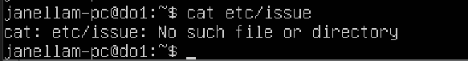
  4. Теперь команда `cat` сработала как надо
      > Потом я узнал про различия абслютного и относительного пути в **Linux** \
      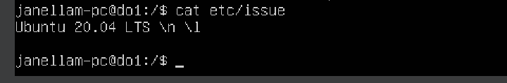

## Part 2. Создание пользователя
  - ### Создаю нового пользователя и добавляю его в группу `adm`.
    1. Назовем его `player456`
    2. Тут я забыл сделать скриншот, поэтому строка с командой пропала в терминале, пришлось заюзать `help` \
    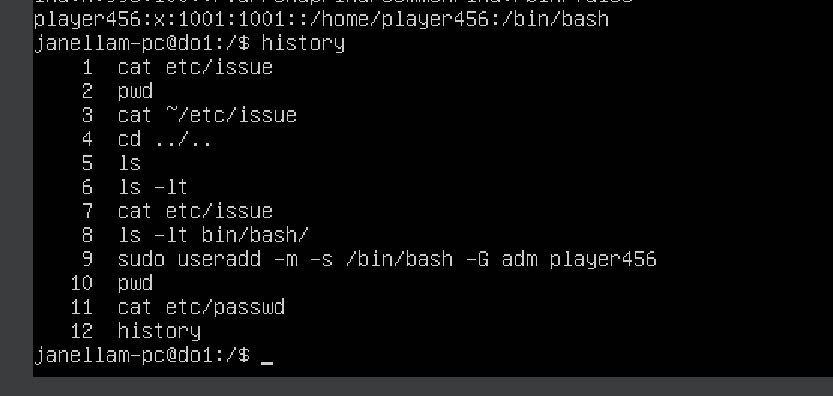
    3. Используем команду `useradd` с правами суперпользователя и флагами `-m` (создает домашнюю директорию), `-s` (добавляет оболчку **bash**), `-G` (добавляет в группу **adm**)
        - Потом я узнал, что надо было добавить флаг `-a`, чтобы не стереть другие группы пользователя, но в моем случае других групп не было
    4. Смотрим вывод команды `cat /etc/passwd` и добавляем `grep` для поиска нужного пользователя \
    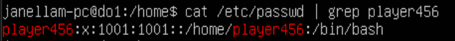

## Part 3. Настройка сети ОС
  - ### Меняю название.
    1. Сначала проверяю текущее имя, затем применяю команду `sudo hostnamectl set-hostname user-1` \
    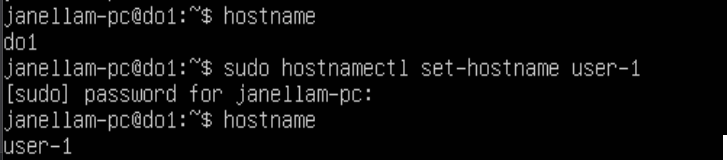
    2. Также обновляем файл `hosts` с помощью редактора **VIM** \
    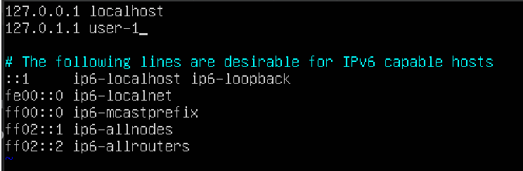
    3. Результат проверяем с помощью команды `hostnamectl` \
    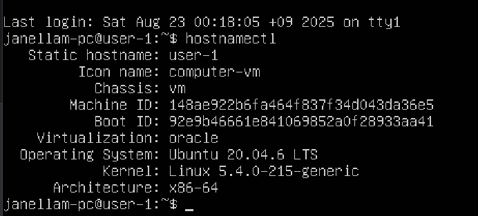  
---
  - ### Установливаю временную зону, соответствующую моему местоположению.
    1. Проверяю текущее время ОС \
    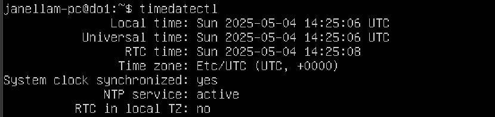
    2. Изменяем на время в Якутске \
    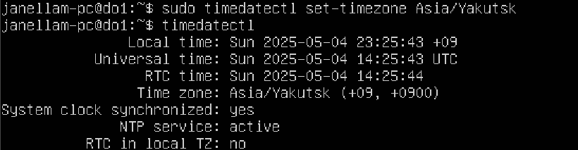
---
  - ### Вывожу названия сетевых интерфейсов с помощью консольной команды.
    1. Использую команду `ip link show` \
    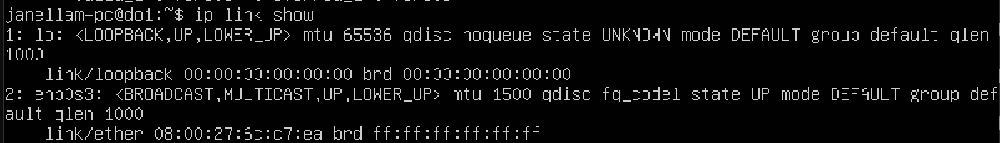
    2. `lo` - это адрес **localhost** (127.0.0.1/8) используется для обращения к локальной машине (ПК, сервер), общаться с самим собой, чтобы тестировать и провести отладку своих проектов (приложений/программ)
---
  - ### Использую консольную команду, получи ip-адрес устройства, на котором ты работаешь, от DHCP-сервера.
    1. Использую команду `ip a`, чтобы узнать сетевое устройство и ip-адрес `10.0.2.15/24` \
    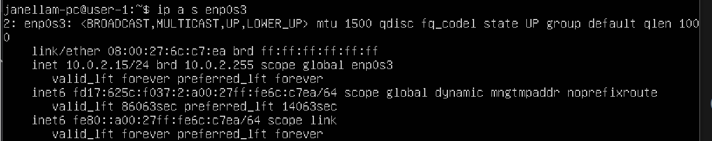
    2. Dynamic Host Configuration Protocol — протокол позволяет автоматически выдавать IP-адрес и другие связанные параметры конфигурации, такие как шлюз по умолчанию и маска подсети, DHCP-клиенту в сети
---
  - ### Определяю внешний ip-адрес шлюза (ip) и внутренний IP-адрес шлюза, он же ip-адрес по умолчанию (gw). 
    1. Находим внешний ip-адрес \
    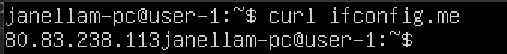
    2. Находим gateway \
    
---
  - ### Делаю настройки ip, gw, dns. 
    1. Создаем новый файл в папке `/etc/netplan` и делаем бэкап старого файла \
    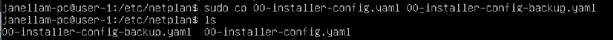
    2. Теперь с помощью текстового редактора **VIM** вносим изменения \
    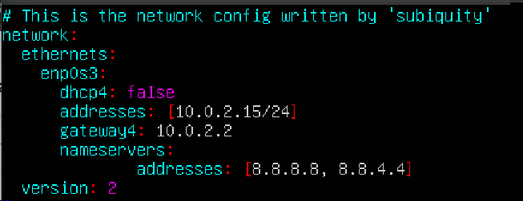
---
  - ### Перезагружаем ВМ. Проверяем сетевые настройки.
    1. Применяем настройки с помощью команды `sudo netplan try` и перезагружаемся \
    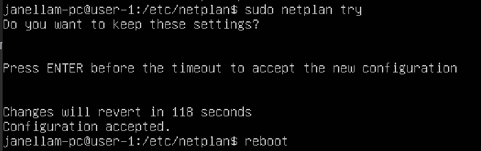
    2. Делаем проверку \
    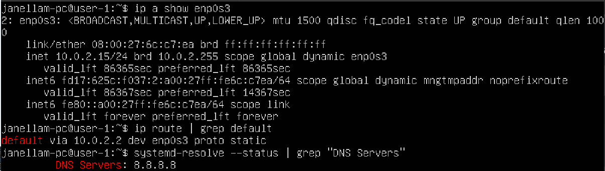
    3. Пингуем хосты 1.1.1.1 и ya.ru из задания \
    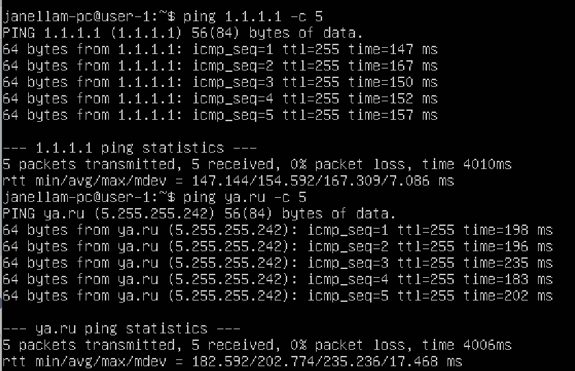

## Part 4. Обновление ОС
  - ### Обновляю системные пакеты до последней версии.  
    1. Проверяю обновления командой `sudo apt update` \
    
    2. Обновляю до последней версии командой `sudo apt upgrade` \
    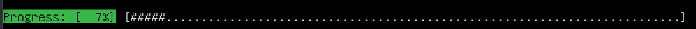
    3. Делаю проверку \
    

## Part 5. Использование команды **sudo**
- ### Добавляю пользователя `player456` в группу `sudo`.
  1. Использую команду `sudo usermod -aG sudo player456`
  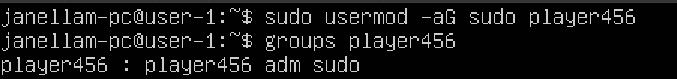 \
  2. Меняю `hostname` \
  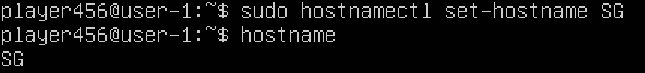
  3. `sudo = SuperUser DO` \
  Позволяет авторизованным пользователям выполнять команды с правами root (администратора). Не переключает полностью на root

## Part 6. Установка и настройка службы времени
- ### Включим автоматическую синхронизацию времени.  
  1. Сначала проверим текущие настройки \
  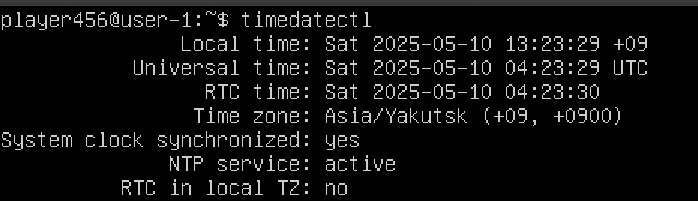
  2. Использую команду `timedatectl show` \
  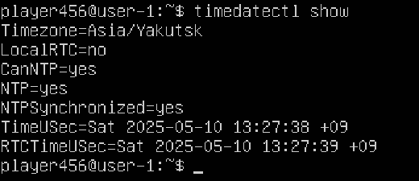

## Part 7. Установка и использование текстовых редакторов 
- ### Текстовые редакторы VIM и NANO уже предустановлены. Дополнительно был установлен редактор MCEDIT с помощью команд `sudo apt install mcedit`.
  1. Создал три текстовых файла \
  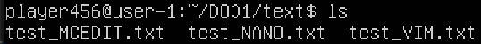
  2. Содержимое файла **test_VIM.txt** \
  Из программы выходим прожимая `Esc`, `:wq + Enter` \
  
  3. Содержимое файла **test_NANO.txt** \
  Из программы выходим прожимая `Ctrl+O`, `Enter`, `Ctrl+X` \
  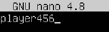
  4. Содержимое файла **test_MCEDIT.txt** \
  Из программы выходим прожимая `F2` и `F10` \
  
---
- ### Меняю никнейм на строку «21 School 21».
  1. Содержимое файла **test_VIM.txt** \
  Из программы выходим прожимая `Esc`, `:q! + Enter` \
  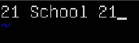
  2. Содержимое файла **test_NANO.txt** \
  Из программы выходим прожимая `Ctrl+X`и `n` \
  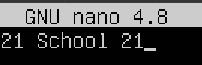
  3. Содержимое файла **test_MCEDIT.txt** \
  Из программы выходим прожимая `F10` и `No` \
  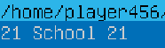
---
- ### Осваиваю функции поиска по содержимому файла и замены слова.
  1. Поиск слова в **VIM** \
  - Использую команду `/player456` \
  
  - Для поиска с заменой пропишем команду `:%s/player456/player001/g`, где символы означают:   
  `s` - заменить в текущей строке, `%` - во всем файле, `g` - в каждой строке \
  
  > для поиска с конца файла можно использовать `?`
  2. Поиск слова в **NANO** \
  - Использую команду `Ctrl+W` и вводим player456 \
  
  - Для замены текста прожимаем `Ctrl+\`, вводим `player456`, затем `player001`, затем `y` \
  
  3. Поиск слова в **MCEDIT** \
  - Для поиска прожимаю `F7` \
  
  - Для замены текста прожимаю `F4` \
  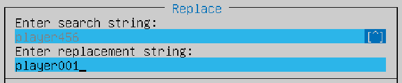

## Part 8. Установка и базовая настройка сервиса **SSHD**
- ### Установливаю службу SSHd. 
  1. Использую команду `sudo apt install openssh-server`. Оказывается служба уже установлена \
  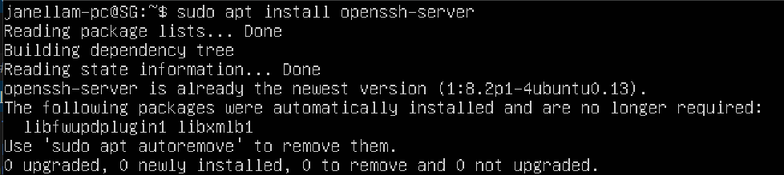
---
- ### Добавляю автостарт службы при загрузке системы.  
  1. Использую команду `sudo systemctl enable ssh.socket` и `ssh.service` \
  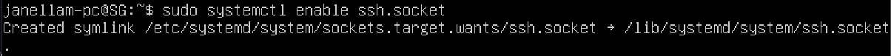
---
- ### Вношу изменения в службу SSHd. 
  1. Через команду `sudo vim /etc/ssh/sshd_config` меняю стандартный порт `22` на `2022` \
  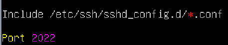
  2. Перезапускаю SSHd через команду `sudo systemctl reload sshd`. Добавляю порт в фаерволле \
  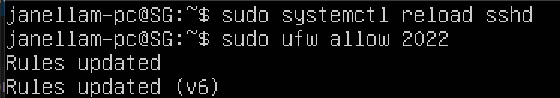
  3. Проверяю порт. Подключаюсь через `ssh 10.0.2.15 -p 2022`. Всё получилось, затем отключаюсь \
  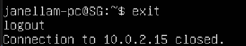
---
- ### Ищем демон sshd через команду ps.
  1. Использую команду `ps aux | grep sshd` \
  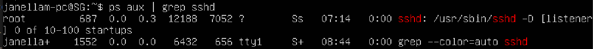
    - Команда `ps` ps показывает список процессов. Ключи: \
    `a` – все процессы, \
    `u` – с детализацией пользователя, \
    `x` – включая фоновые процессы
---
- ### Перезагружаемся.
  1. Проверяем порты командой `netstat -tan` добавляем к ней `| grep 2022` \
  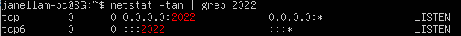
    `t` – показывает TCP-соединения, \
    `a` – показывает все порты, \
    `n` – числовые адреса вместо доменных, \
    `0.0.0.0` - прослушивает все сетевые интерфейсы \
  2. Про значения столбцов в выводе `netstat -tan` \
  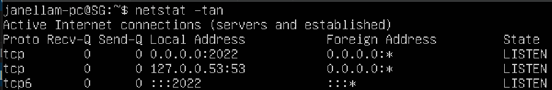
    - `Proto` — тип сетевого протокола соединения:
      + **TCP** — протокол для надёжных соединений (гарантирует доставку пакетов), использует 32-битные IPv4-адреса
      + **TCP6** — реализация TCP для IPv6, использующая 128-битные адреса
      + **UDP** — протокол для быстрых соединений без гарантии доставки пакетов
    - `Recv-Q` (Receive Queue) — объём данных (в байтах), ожидающих обработки принимающим процессом. Ненулевое значение указывает на возможную перегрузку или проблемы с производительностью приложения.
    - `Send-Q` (Send Queue) — объём данных (в байтах), ожидающих отправки через сетевой интерфейс. Ненулевое значение может свидетельствовать о том, что процесс генерирует данные быстрее, чем сеть способна их передать.
    - `Local Address` — IP-адрес и порт локального устройства, на котором запущена команда netstat.
    - `Foreign Address` — IP-адрес и порт удалённого устройства, с которым установлено соединение. Значение localhost указывает на внутреннее соединение процесса с самим собой (loopback).
    - `State` — текущее состояние соединения:
      + **LISTEN** — ожидание входящих подключений
      + **ESTABLISHED** — активное соединение
      + **CLOSE_WAIT** — соединение закрыто удалённой стороной

## Part 9. Установка и использование утилит **top**, **htop**
- ### Юзаю утилиты top и htop. 
  1. Смотрим top \
  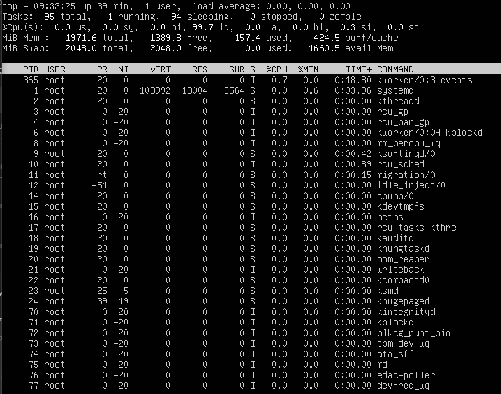
  - **Uptime:**
    - в первой строке **up 39 min**
  - **Количество авторизованных пользователей:**
    - **1 user** авторизован
  - **Общая загрузка системы:**
    - **load average** 0.00. загрузка системы в трёх временных отрезках: за последнюю 1 минуту, последние 5 минут, и 15 минут
  - **Общее количество процессов:**
    - **Tasks: 90 total**
      - **running** - это запущенные процессы
      - **sleeping** - процессы ждущие какого-то события, ждут либо сигнал, или когда RAM память освободится, или пока CPU дойдет до них в очереди
      - **stopped** - это остановленные, они не используют ресурсов но сидят в списке процессов
      - **zombie** - это процесс который завершил исполнение но его ещё не вычистили из таблицы. Ресурсов не ест
  - **Загрузка CPU:**
    - **%CPU(s): 0.0**
      - **us** - user процессы
      - **sy** - system процессы
      - **id** - idle процессы
  - **Загрузка RAM:**
    - **157.4 used** - используется 157.4 MB из 1971.6 MB доступной оперативной памяти
  - **PID с наибольшим RAM использованием:**
    - прожимаю **Shift+M**, `top` сортирует всё по `memory usage`
    - видим PID **636**, процесс **snapd** \
    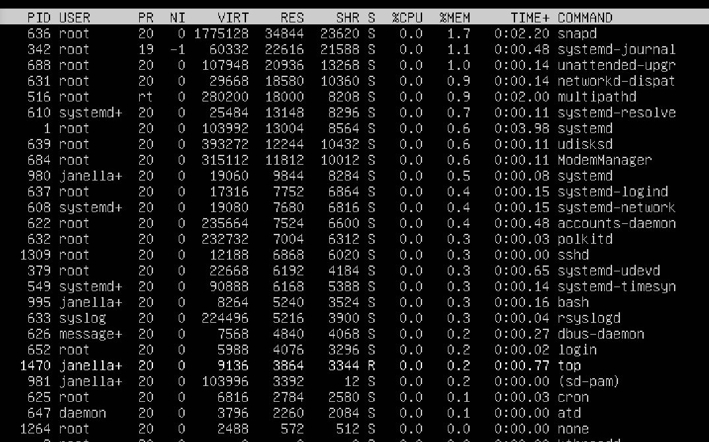
  - **PID с наибольшим CPU временем:**
    - прожимаю **Shift+P**, сортировка по `CPU usage`
    - видим **janellam-pc**, процесс **top**, номер PID **1470** \
    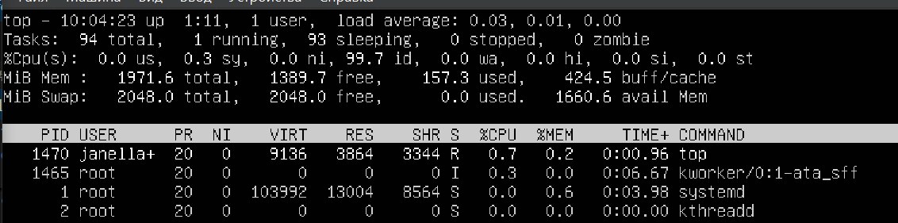
  2. Смотрим htop
    - жмем **F6** для вызова меню сортировки: 
    - **PID** \
    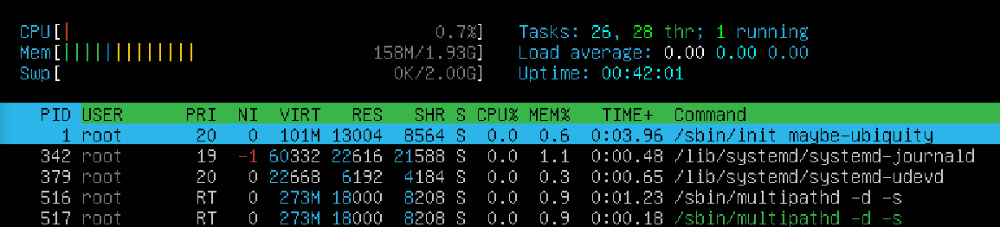
    - **PERCENT_CPU** \
    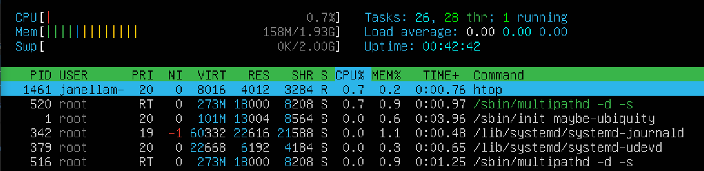
    - **PERCENT_MEM** \
    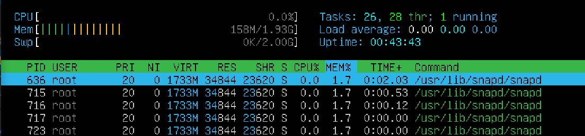
    - **TIME** \
    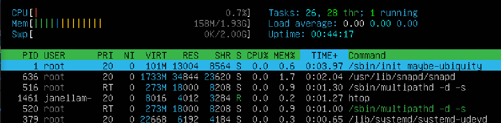
    - **Отфильтрованный для процесса SSHD:** \
    юзаю **F4**, ввожу **sshd** \
    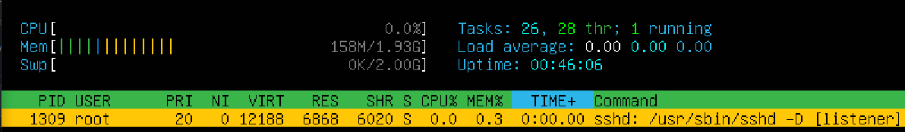
    - **С процессом syslog, найденным через поиск:** \
    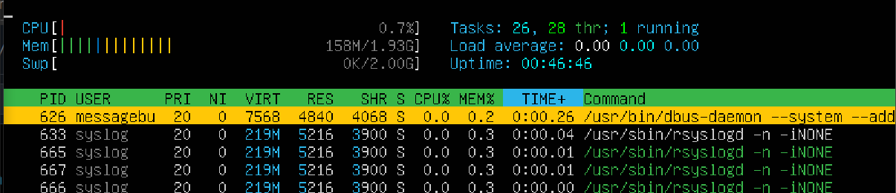
    - **С добавленным выводом hostname, clock, uptime:** \
    жмем **F2**, выбираем **Meters** \
    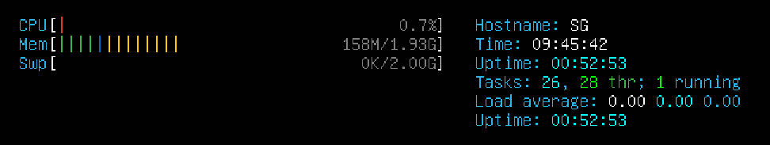 

## Part 10. Использование утилиты **fdisk**
- ### Запусти fdisk.
  1. Использую команду `sudo fdisk -l` \
  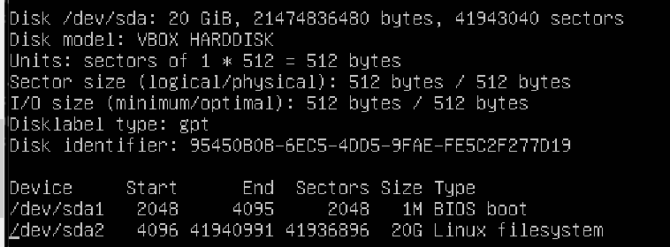
  - название жетского диска: `/dev/sda`
  - модель жесткого диска: `VBD HARDDISK`
  - размер: `20 GiB`
  - количество секторов: `41 943 040`
  - размер сектора: `512 bytes`
  2. Смотрим swap командой `free -h` \
  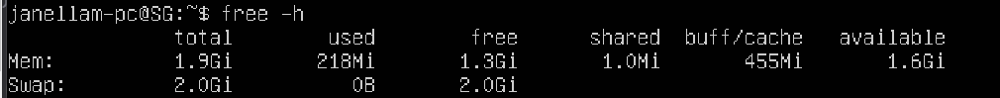
  - swap: `2 Gi`

## Part 11. Использование утилиты **df** 
- ### Запускаю команду df. \
  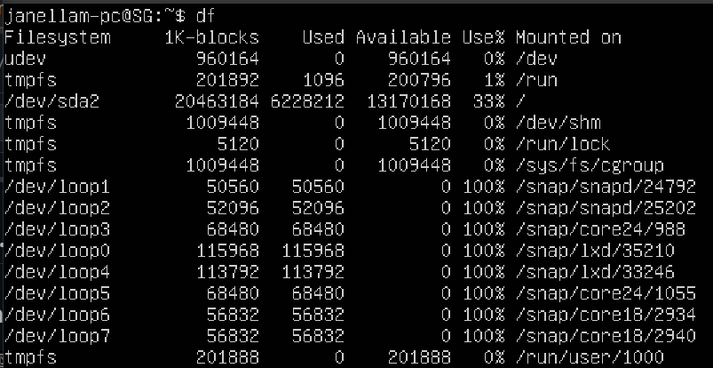
  - размер раздела: `20 463 184`
  - размер занятого пространства: `6 228 212`
  - размер свободного пространства: `13 170 168`
  - процент использования: `33%`
  - еденица измерения: `1K-block = 1024 bytes` 
---
- ### Запускаю команду df -Th. \
  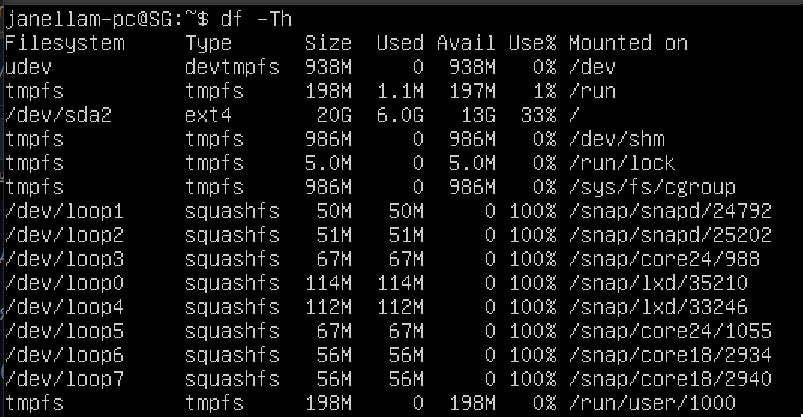
    - флаги `-Th`: `T` - вывод файловой системы, `h` - все значения выводятся в удобочитаемом формате (K, M, G вместо байтов)
    - размер раздела: `20G`
    - размер занятого пространства: `6G`
    - размер свободного пространства: `13G`
    - процент использования: `33%`
    - тип файловой системы: `ext4`
      + стандартная журналируемая для Linux

## Part 12. Использование утилиты **du**
- ### Запускаю команду du. \
  
---
- ### Вывод размера папок /home, /var, /var/log. 
  - в байтах: \
  
  - в человекочитаемом виде: \
  
---
- ### Вывод размера всего содержимого в /var/log (не общее, а каждого вложенного элемента, используя *).
  - использую команду `sudo du -sh /var/log/*` для вывода каждого элемента: \
  

## Part 13. Установка и использование утилиты **ncdu**
- ### Установил утилиту ncdu.
  1. Использую команду `sudo apt install ncdu` \
  
---
- ### Вывел размер папок /home, /var, /var/log.
  - /home \
  
  - /var \
  
  - /var/log \
  
  - в корневой папке \
  
  - в папке /var \
  

## Part 14. Работа с системными журналами
- ### /var/log/dmesg
  - журнал сообщений ядра (kernel ring buffer). Содержит информацию о загрузке оборудования, драйверов, аппаратных ошибках \
  
---
- ### /var/log/syslog
  - основной системный журнал. Содержит сообщения от всех системных служб и приложений \
  
---
- ### /var/log/auth.log  
  - журнал аутентификации. Содержит информацию о входах пользователей, sudo, SSH-подключениях \
  
---
- ### Время последней успешной авторизации.
  
    + время: `Aug 25 17:32:20`
    + пользователь: `janellam-pc`
    + метод: `pam`
---
- ### Перезапускаю службу SSHd.
  - юзаю команду `sudo systemctl restart sshd`
  - ищу в логах syslog `sudo tail /var/log/syslog` \
  

## Part 15. Использование планировщика заданий CRON
- ### Запускаю планировщик заданий и команду uptime через каждые 2 минуты.
  1. Синтаксис **cron**: \
  `минута час день месяц день_недели /путь/к/исполняемому/файлу`
   команда для редактирования `crontab -e`
   ищу через `sudo tail /var/log/syslog` \
  
  2.  Cписок текущих заданий \
  
---
- ### Удаляю все задания из планировщика заданий.
  1. Юзаю `crontab -e` и удаляю задания, проверяю \
  
