# Отчет по выполнению задания "Сети в Linux"
- Я изучил настройки сетей в Linux на вирутальных машин. 

## List
1. [Инструмент ipcalc](#part-1-инструмент-ipcalc)
2. [Статическая маршрутизация между двумя машинами](#part-2-статическая-маршрутизация-между-двумя-машинами)
3. [Утилита iperf3](#part-3-утилита-iperf3)
4. [Сетевой экран](#part-4-сетевой-экран)
5. [Статическая маршрутизация сети](#part-5-статическая-маршрутизация-сети)
6. [Динамическая настройка IP с помощью DHCP](#part-6-динамическая-настройка-ip-с-помощью-dhcp)
7. [NAT](#part-7-nat)
8. [Знакомство с SSH Tunnels](#part-8-знакомство-с-ssh-tunnels)

## Part 1. Инструмент **ipcalc**
- ### Устанавливаю **ipcalc** командой `sudo apt install ipcalc`
    1. #### Сети и маски. Определи и запиши в отчёт:
    - Адрес сети *192.167.38.54/13* = 192.160.0.0 \
    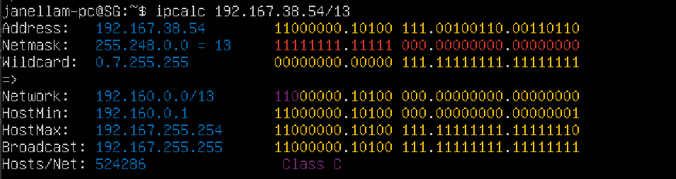 
    - Перевод маски *255.255.255.0* в префиксную = /24 \
    и двоичную запись = 11111111.11111111.11111111.00000000, \
    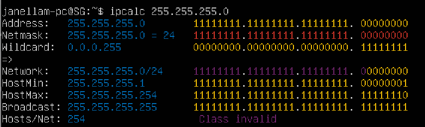
    - */15* в обычную = 255.254.0.0. \
    и двоичную = 11111111.11111110.00000000.00000000, \
    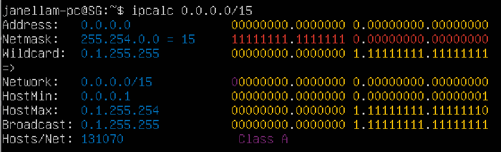
    - *11111111.11111111.11111111.11110000* в обычную = 255.255.255.240 \
    `Из-за того, что двоичную форму адреса передать на вход ipcalc нельзя мы 11111111.11111111.11111111.11110000 переводим в обычную 11111111 = 255.` \
    `Вычисляем 11110000: 2^7 + 2^6 + 2^5 + 2^4 = 128 + 64 + 32 + 16 = 240` \
    и префиксную = /28 (просто складываем все единицы)
    - Минимальный и максимальный хост в сети *12.167.38.4* при масках: 
        + /8: HostMin: 12.0.0.1, HostMax: 12.255.255.254 \
        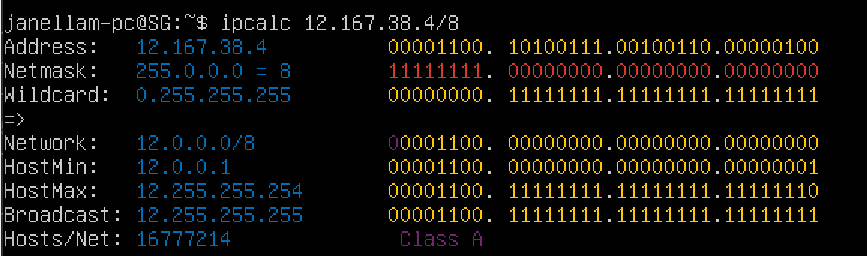
        + *11111111.11111111.00000000.00000000* (складываем единицы, получаем префикс /16), \
        /16: HostMin: 12.167.0.1, HostMax: 12.167.255.254 \
        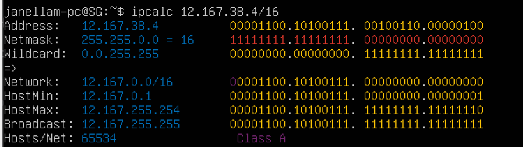
        + *255.255.254.0* (переводим в двоичную и складываем 8 + 8 + 7 = 23), \
        /23: HostMin: 12.167.38.1, HostMax: 12.167.39.254 \
        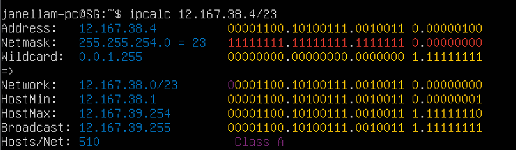
        + /4: HostMin: 0.0.0.1, HostMax: 15.255.255.254 \
        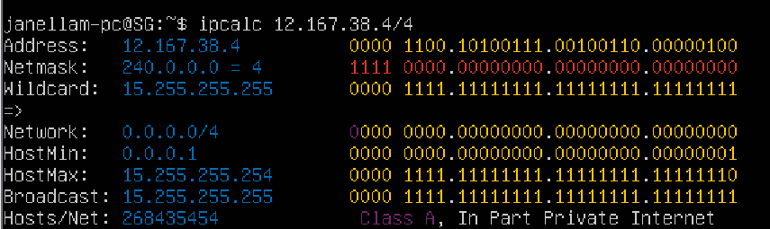

    2. #### localhost
    - Можно ли обратиться к приложению, работающему на localhost, со следующими IP: *194.34.23.100*, *127.0.0.2*, *127.1.0.1*, *128.0.0.1*? \
    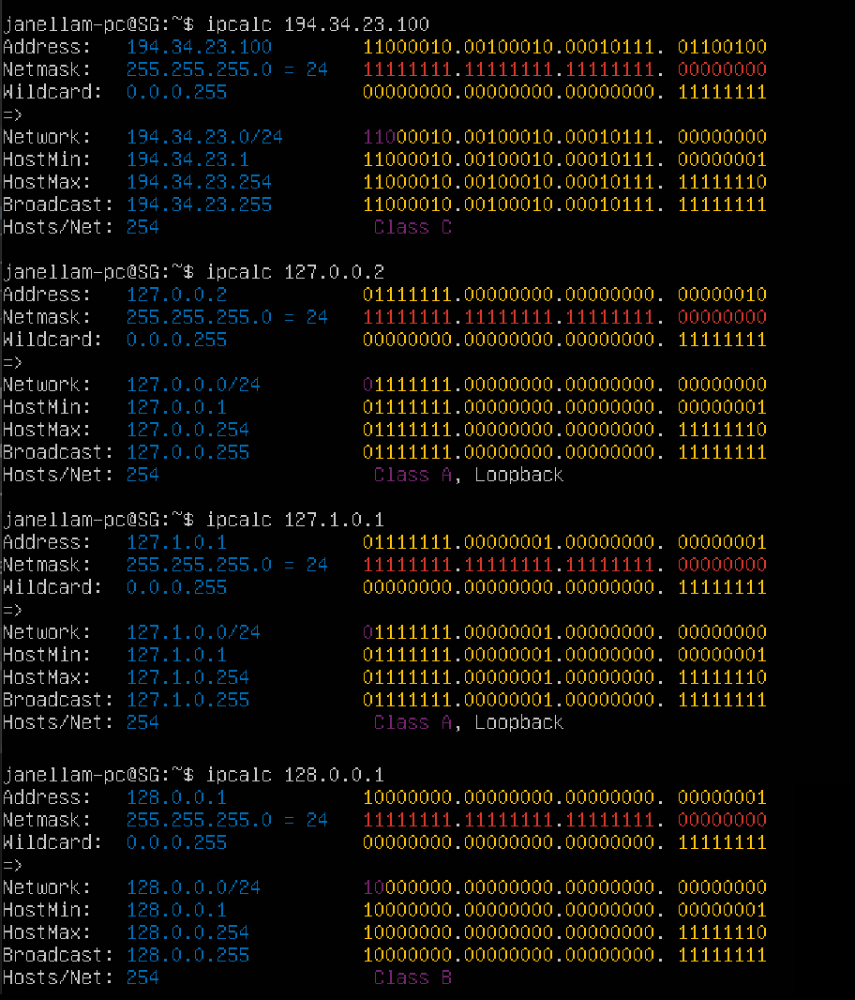
    Можно только с двух адресов: **127.0.0.2**, **127.1.0.1** (имеют параметр Loopback)

    3. #### Диапазоны и сегменты сетей
    - Определи и запиши в отчёт: `какие из перечисленных IP можно использовать в качестве публичного, а какие только в качестве частных:`
        чтобы не вводить это всё вручную напишем небольшой bash скрипт \
        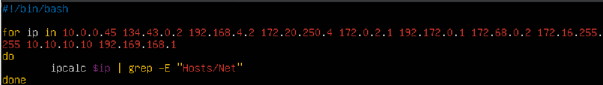
        10.0.0.45, **частный**\
        `134.43.0.2, публичный`\
        192.168.4.2, **частный**\
        172.20.250.4, **частный** \
        `172.0.2.1, публичный` \
        `192.172.0.1, публичный` \
        `172.68.0.2, публичный` \
        172.16.255.255, **частный**\
        10.10.10.10, **частный**\
        `192.169.168.1, публичный` \
        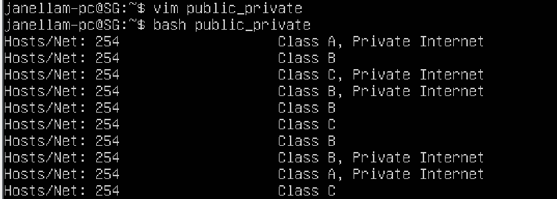
        > Можно также использовать общеизвестный диапазон локальных адресов: 
          Класс А: 10.0.0.0 – 10.255.255.255
          Класс Б: 172.16.0.0 – 172.31.255.255
          Класс С: 192.168.0.0 – 192.168.255.255
    - Определи и запиши в отчёт: `какие из перечисленных IP-адресов шлюза возможны у сети 10.10.0.0/18:` \
        `10.0.0.1, невозможен`\
        10.10.0.2, **возможен**\
        10.10.10.10, **возможен**\
        `10.10.100.1, невозможен`\
        10.10.1.255 **возможен**\
        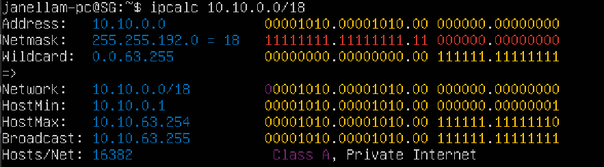
        > Мы видим, что диапазон IP-адресов сети, который \
        можно использовать для шлюза: *10.10.0.1-10.10.68.254*

## Part 2. Статическая маршрутизация между двумя машинами
- ### Поднимаю две виртуальные машины (далее -- ws1 и ws2)
    1. #### Смотрим сетевые интерфейсы ВМ
    > Для выполнения задания я клонировал ВМ из **DO1** \
    и потом переименовал их в `/etc/hostname`
    - ws1 \
    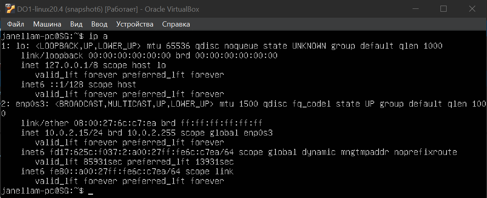
    - ws2 \
    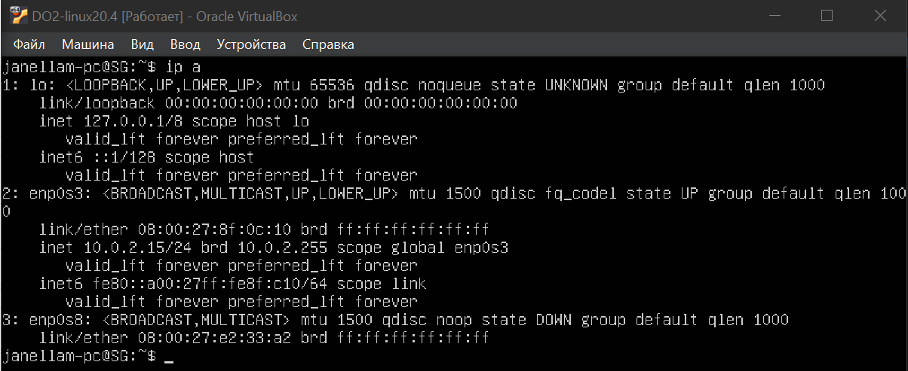

    2. #### Даем описание сетевого интерфейса ВМ соответствующий внутренней сети
    - **ws1** - Сетевой интерфейс отсутствует
    - **ws2** - Сетевой интерфейс enp0s8 - выключен
    - Перед начало работы включаем 2 сетевую карту через VBox-менеджер в режиме внутренняя сеть \
    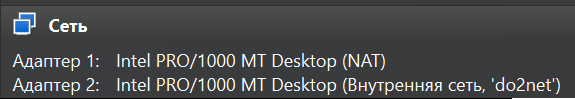
    - Задаем статический для ws1 \
    
    - Задаем статический для ws2 \
    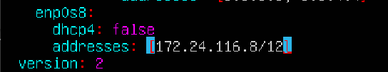
    - Применяем настройки сети на ws1 \
    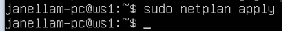
    - Применяем настройки сети на ws2 \
    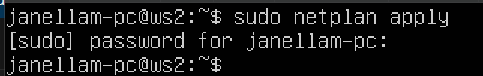

    3. #### Добавляю статические маршруты вручную
    - Добавляю статический маршрут от одной машины до другой \
    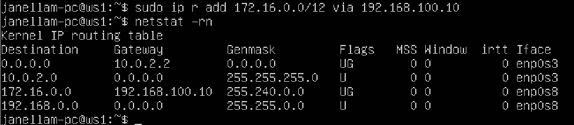
    - и обратно используя `ip r add` \
    
    - Пропингуй из ws1 \
    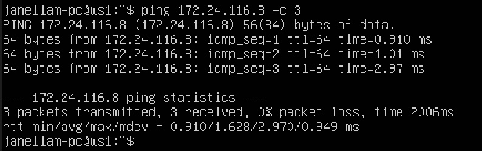
    - Повторяю с ws2 \
    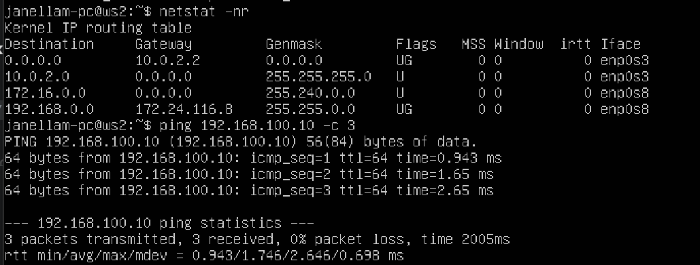

    4. #### Теперь тоже самое с сохранением
    - Добавляем статический маршрут в `netplan` и потом делаем `sudo netplan apply` и `reboot` 
    - ws1 *.yaml \
    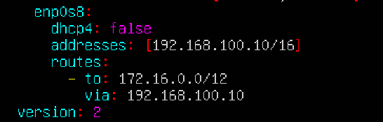
    - ws2 *.yaml \
    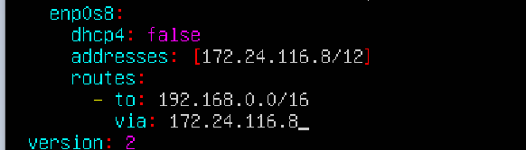
    - Пингуем \
    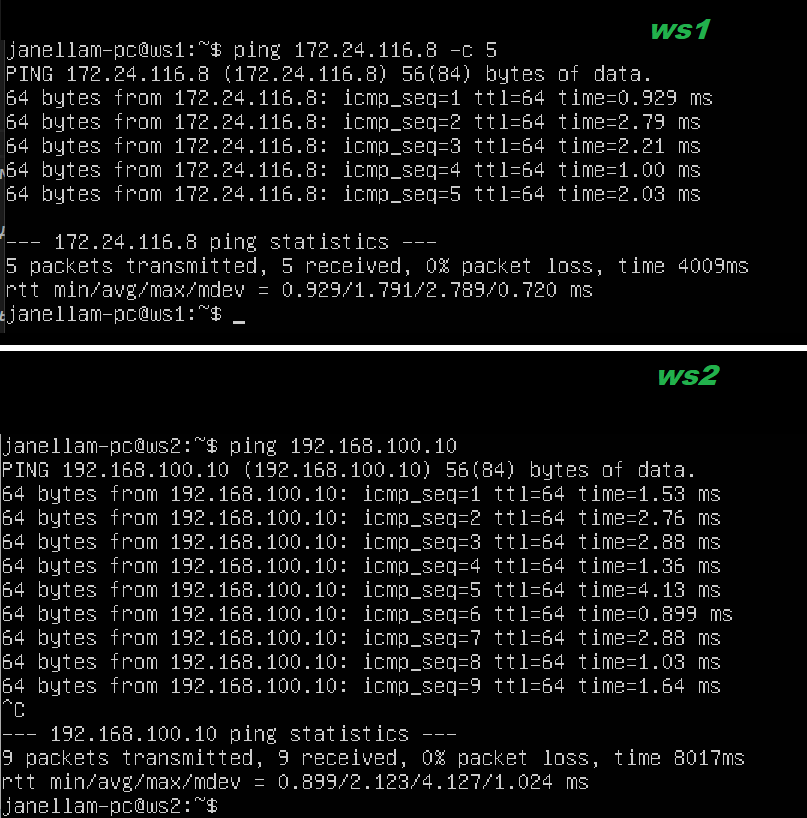

## Part 3. Утилита **iperf3**
- ### Перевожу, вычисляю и т.д.
    1. #### Делаю расчет
    - Формулы: \
    `1 Мегабайт (MB) = 8 Мегабит (Mb)` \
    `1 Мегабит (Mb) = 1024 Килобит (Kb)` 
    - `8 Mbps в MB/s` = 1\
    - `100 MB/s в Kbps` = 819200\
    - `1 Gbps в Mbps` = 1024

    2. #### Измерь скорость соединения между ws1 и ws2
    - Устанавливаю утилиту `iperf3`, потом ws2 делаю сервером \
    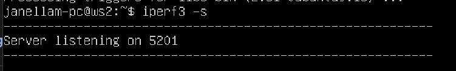
    - Запускаю проверку скорости клиента от ws1 \
    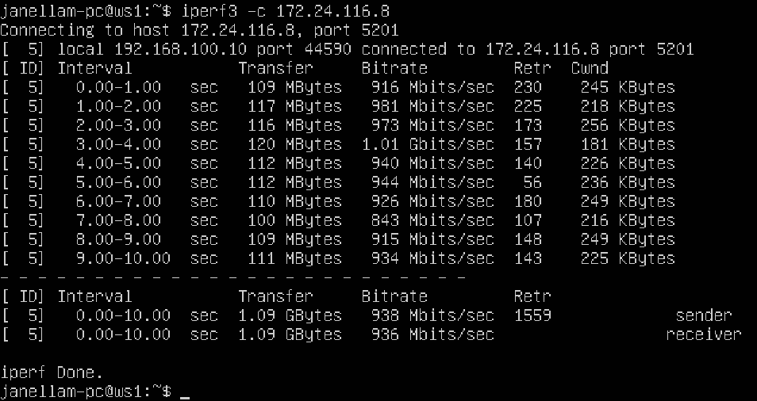
    - Скорость у сервера \
    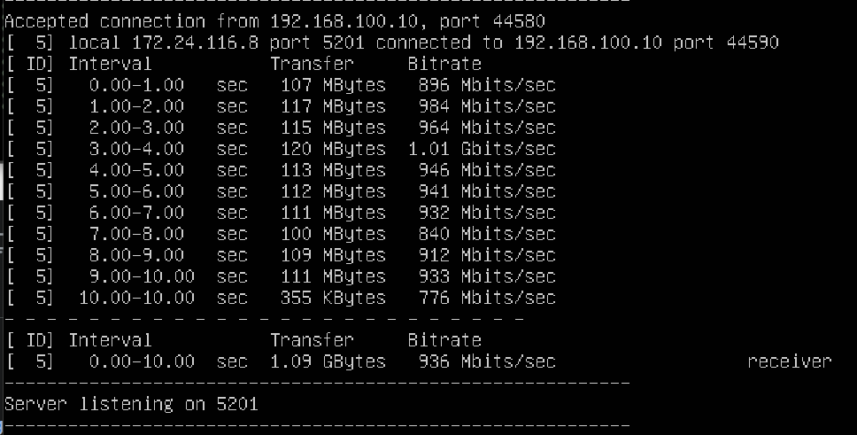

## Part 4. Сетевой экран
- ### Утилита **iptables**
    > - iptables -F \
    _#удалить все правила (допускает указание отдельной цепочки правил)_
    > - iptables -X \
    _#удалить указанную цепочку (необходимо очистить правила цепочки)_
    - Синтаксис `iptables [-t таблица] команда [критерий] [ -j цель]`

    1. #### Добавляем правила согласно заданию
    - На ws1 примени стратегию, когда в начале пишется запрещающее правило, а в конце пишется разрешающее правило \
    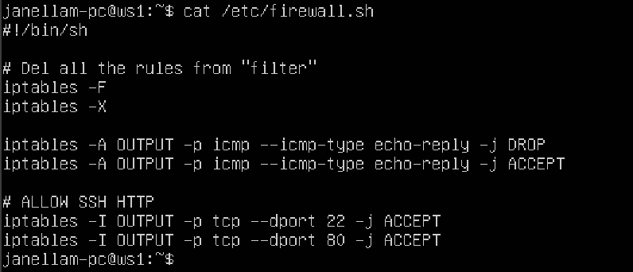
    - На ws2 примени стратегию, когда в начале пишется разрешающее правило, а в конце пишется запрещающее правило \
    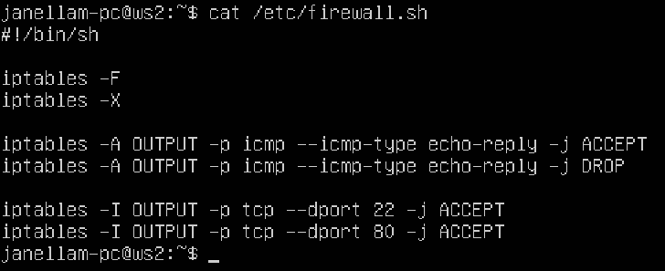

    2. #### Запускаю файлы на ВМ командой `sudo /etc/firewall.sh` (предварительно выдав разрешения `chmod +x /etc/firewall.sh`)
    - ws1 и пингую ws2 \
    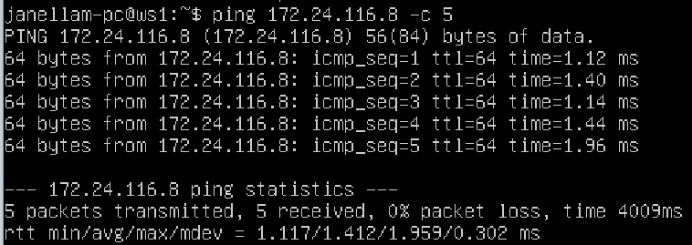
    - ws2 и пингую ws 1. Из-за правила запрета нет исходящего ping-ответа, второе разрешающее правило никогда не сработает из-за первого (особенность `iptables`) \
    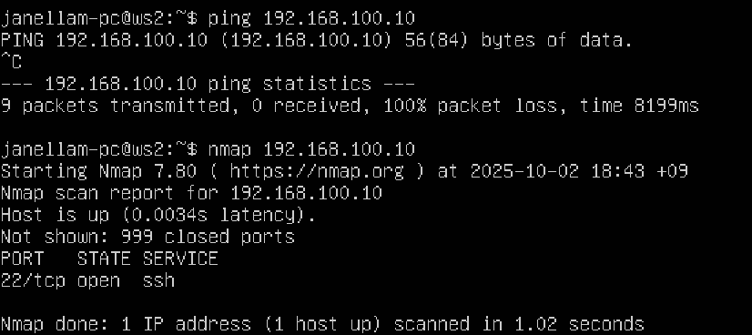

## Part 5. Статическая маршрутизация сети
- ### Поднимаю пять виртуальных машин (3 рабочие станции (ws11, ws21, ws22) и 2 роутера (r1, r2))
    1. #### Настройка адресов машин
    - Настраиваю сети согласно рисунку \
    
    - ws11 \
    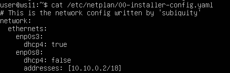
    - r1 \
    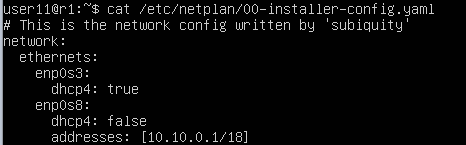
    - ws21 \
    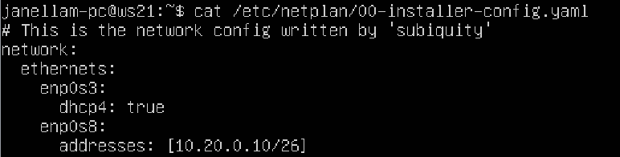
    - ws22 \
    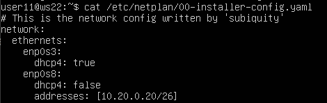
    - r2 \
    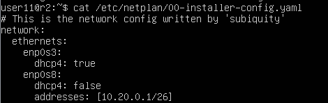
    - Вывожу адрес и пингую ws22 с ws21 \
    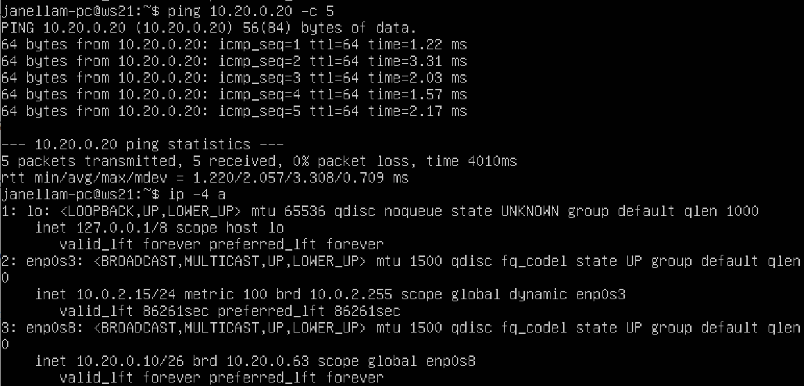
    - Тоже самое с ws11 на r1 \
    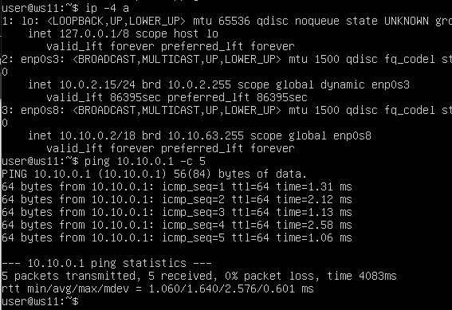

    2. #### Включение переадресации IP-адресов
    - Выполняю команду на роутерах `sysctl -w net.ipv4.ip_forward=1` \
    - на r1 \
    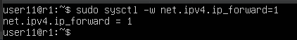
    - на r2 \
    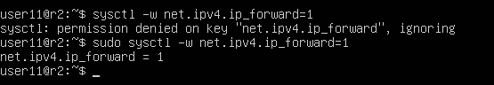
    - Делаю переадресацию постоянной через файл */etc/sysctl.conf* и раскомментирую следующую строку `net.ipv4.ip_forward = 1`
    - на r1, на r2 также поэтому скрин 1 общий \
    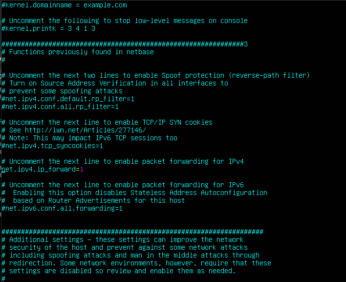
    
    3. #### Установка маршрута по умолчанию
    - ws11 \
    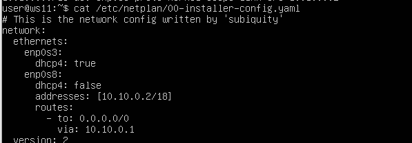
    - ws21 \
    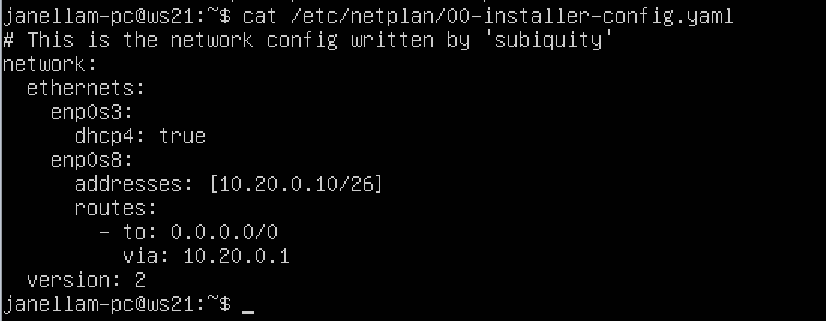
    - ws22 \
    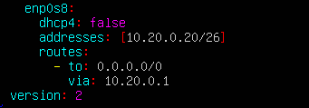
    - С помощью комаду `ip r` показываю маршуты в таблице маршрутизации 
    - ws11 \
    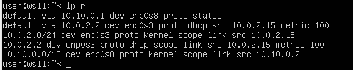
    - ws21 \
    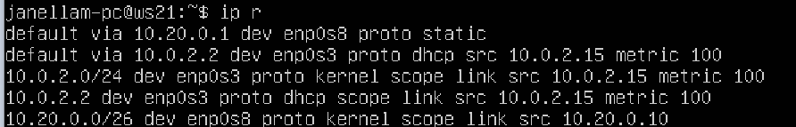
    - ws22 \
    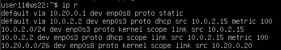
    - Пропингую с ws11 роутер r2 \
    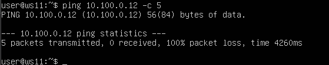
    - Показываю, что на r2 пинг доходит с помощью команды `tcpdump -tn -i enp0s8`
    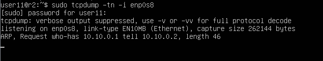
    - Кратко про флаги `tcpdump` \
     -i — _*(interface)_ указывает, какой сетевой интерфейс слушать \
     -n - _*(no resolution)_ не преобразовывать адреса в имена \
     -t - _*(no timestamp)_ не показывать временные метки \
     -v - _*(verbose)_ подробный вывод

    4. #### Добавляем статические маршруты для роутеров
    - r1 \
    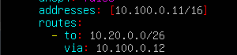
    - r2 \
    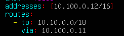
    - Вызываю `ip r` на r1 \
    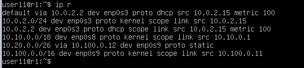
    - Тоже самое на r2 \
    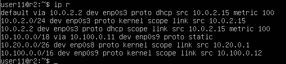
    - Запускаю команды на ws11 `ip r list 10.10.0.0/18` и `ip r list 0.0.0.0/0`
    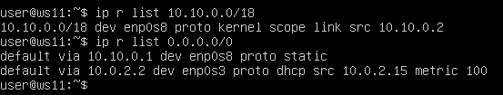
    - Отличия маршрута адреса 10.10.0.0/18 от 0.0.0.0/0: \
     более точный маршрут в таблице всегда имеет приоритет над широким default. \
     Маршрут 10.10.0.0/18 имеет маску /18 (более специфичный), а маршрут по умолчанию 0.0.0.0/0 имеет маску /0 (самый общий).
    
    5. #### Построение списка маршрутизаторов
    - Запускаю на r1 команду `tcpdump -tnv -i enp0s8` \
    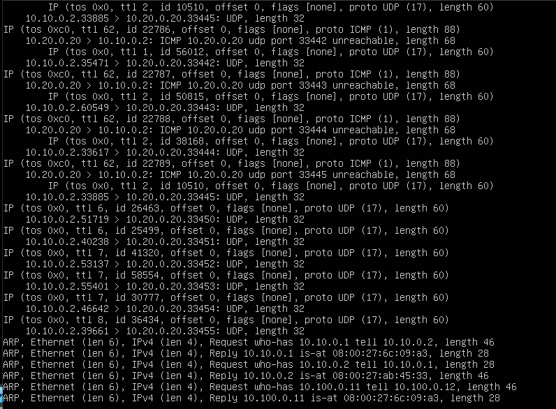
    - Пакеты TTL успешно достигли хоста, ответ ICMP подтверждают получение хостом пакета, и ARP запросы тоже достигли хоста \
    - На ws11 запускаю команду до ws22 `traceroute 10.20.0.20`
    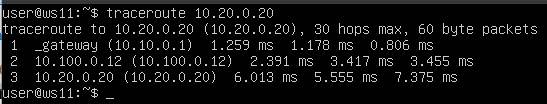
    - Путь успешно построен: 
        - Hop 1: Шлюз 10.10.0.1 (r1) 
        - Hop 2: Маршрутизатор 10.100.0.12 (r2) 
        - Hop 3: Конечный хост 10.20.0.20 (ws21)
    - Traceroute строит путь, последовательно "прощупывая" каждый хоп с помощью пакетов с увеличивающимся TTL. Ответы ICMP Time Exceeded от маршрутизаторов раскрывают цепочку промежуточных узлов, а ICMP Port Unreachable от конечного хоста сигнализирует о завершении трассировки. ARP обеспечивает преобразование IP-адресов в MAC-адреса на канальном уровне, без чего невозможна доставка пакетов между соседними узлами
    
    6. #### Использование протокола **ICMP** при маршрутизации
    - Запускаю на r1 перехват сетевого трафика, проходящего через eth0 с помощью команды `tcpdump -n -i enp0s8 icmp`
    - Пингую с ws11 несуществующий IP *10.30.0.111* \
    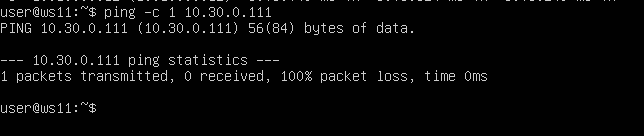
    - На r1 вижу \
    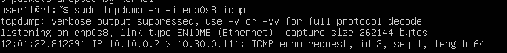

## Part 6. Динамическая настройка IP с помощью **DHCP**
- ### Настраиваю виртуальные машины из Part 5.
    1. #### Настраиваю r2 согласно примеру 
    - Скачиваю `isc-dhcp-server` и меняю настройки в файле `/etc/dhcp/dhcpd.conf` \
    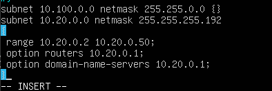
    - Вношу изменения в файл `resolv.conf` \
    
    - Перезагружаю службу **DHCP** командой `systemctl restart isc-dhcp-server` \
    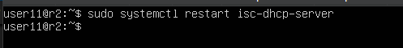
    - Делаю ребут ws21 смотрим `ip a`, а также пингую ws22 с ws21 \
    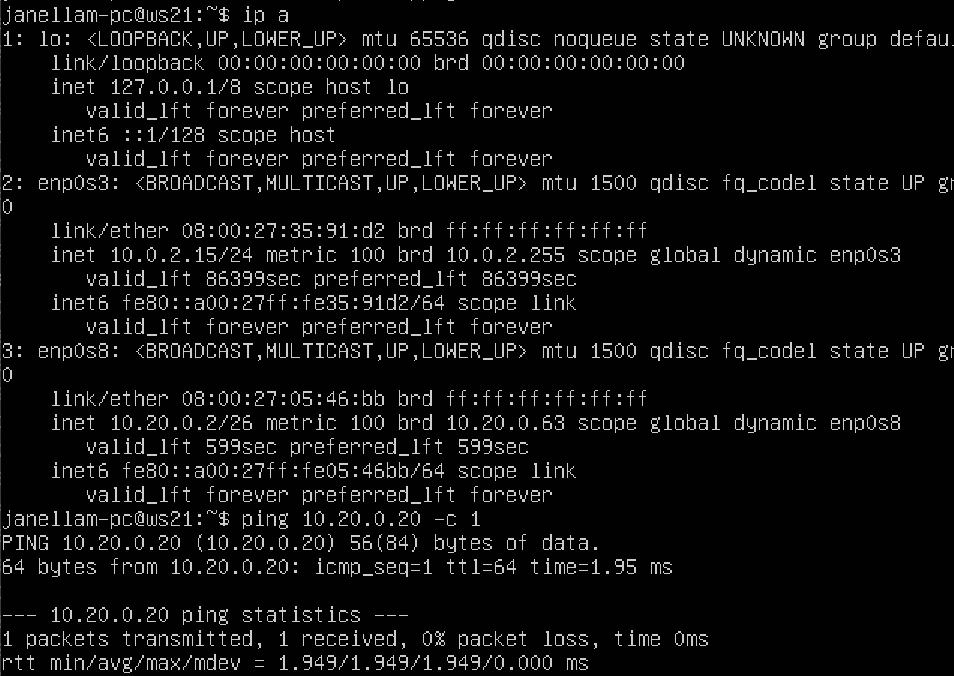
    - Видим enp0s8 и IP-адрес 10.20.0.2/26
    - У ws11 в файле `etc/netplan/00-installer-config.yaml` меняю настройки \
    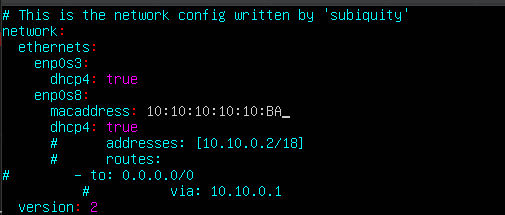
    - Для r1 настройки аналогично r2, но выдача адресов с жесткой привязкой к MAC-адресу (ws11). \
    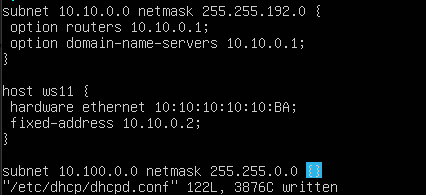
    - Опции DHCP сервера:
        + range — диапазон адресов для сети
        + routers — основной шлюз для получателей
        + domain-name-servers — DNS cервера
        + hardware ethernet и fixed-address — жёсткая выдача по MAC
    - IP у ws11 до измненения \
    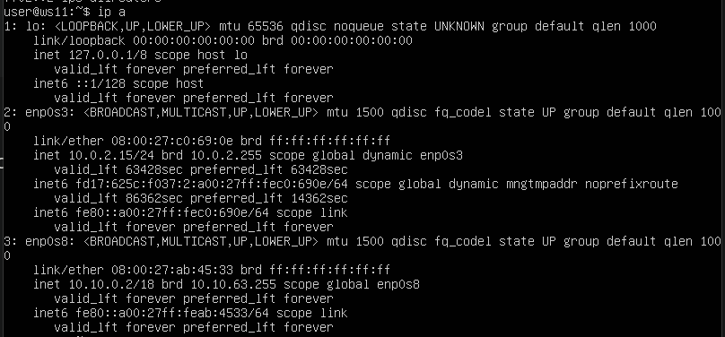
    - Выдача IP у ws11 \
    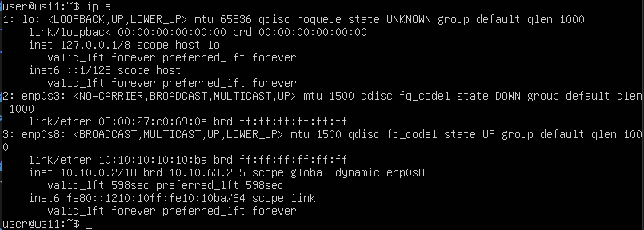
    - Почему-то хост никак не получал IP-адрес пока не сменил его также в настройках ВМ \
    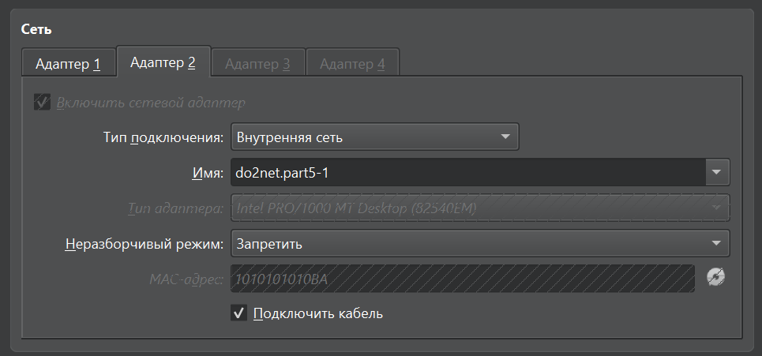
    - Пингую r1 \
    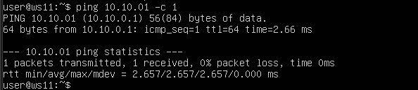
    - Показываю адрес ws21 \
    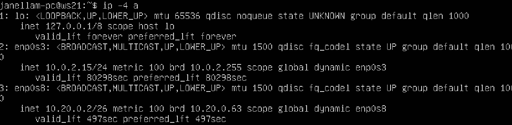
    - Обновляю IP у ws21. Сначала делаю сброс настроек DHCP, а потом обновляю их \
    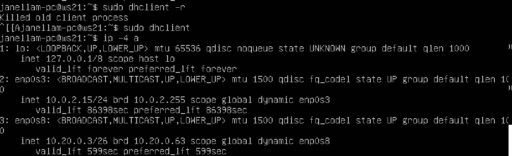

## Part 7. **NAT**
- ### Настроиваю apache2
    1. #### Меняю конфиг с портами на ws22 и r1
    - ws22 и аналогично для r1 \
    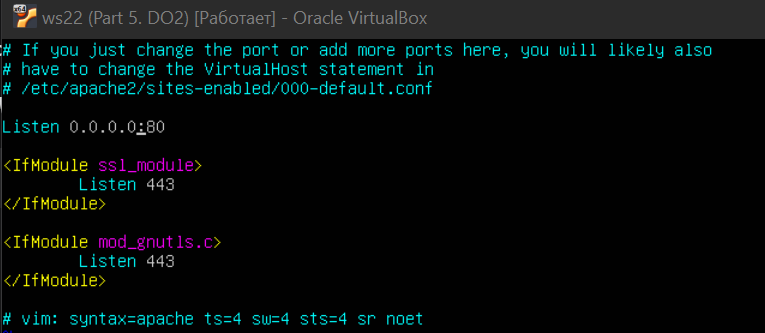
    - Запускаю сервер `apache2` на ws22 и r1 \
    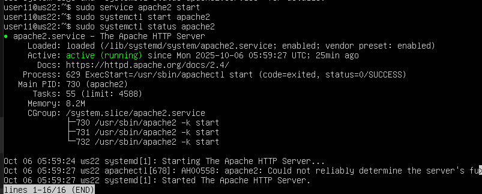
    - Также для r1 \
    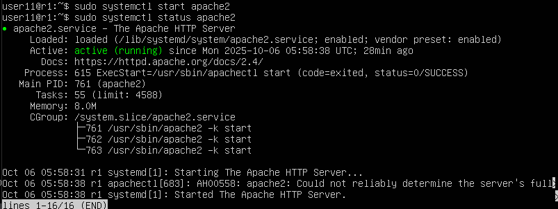

    2. #### Добавляю firewall на r2
    - Создаю баш файл с командами для `iptables` и запускаю его\
    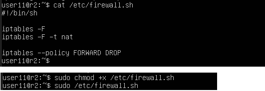
    - Проверяю ping между ws22 и r1 \
    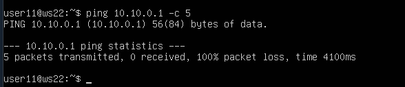
    - Разрешаю маршрутизацию пакетов `ICMP` \
    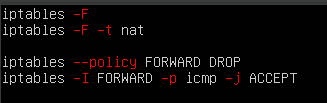
    - Пингую r1 от ws22 \
    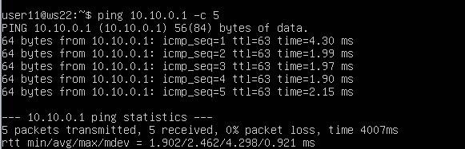
    - Включаю правила `SNAT` \
    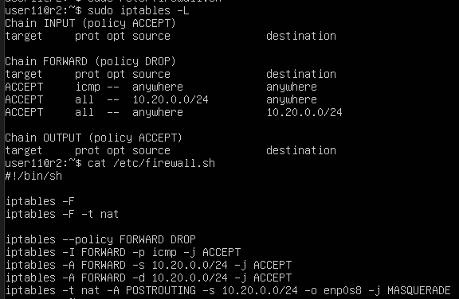
    - Проверяю соединение ws22 и r1 через `telnet` \
    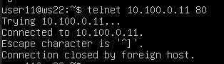
    - Включаю правила `DNAT` \
    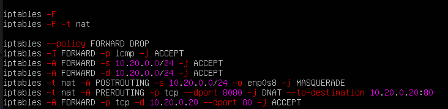
    - Проверяю соединение r1 и ws22 через `telnet` \
    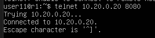

## Part 8. Знакомство с **SSH Tunnels**
- ### В данном задании используются виртуальные машины из Части 5
    1. #### Запускаю на r2 фаервол с правилами из Части 7 командой `sudo /etc/firewall.sh`

    2. #### Запускаю веб-сервер **Apache** на ws22 только на localhost
    - Изменил файл `ports.conf` \
    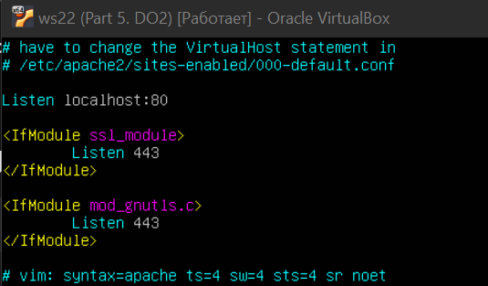
    - Запускаю сервер командой `sudo systemctl start apache2`

    3. #### Использую *Local TCP forwarding* с ws21 до ws22, чтобы получить доступ к веб-серверу на ws22 с ws21.
    - Подключение удалось \
    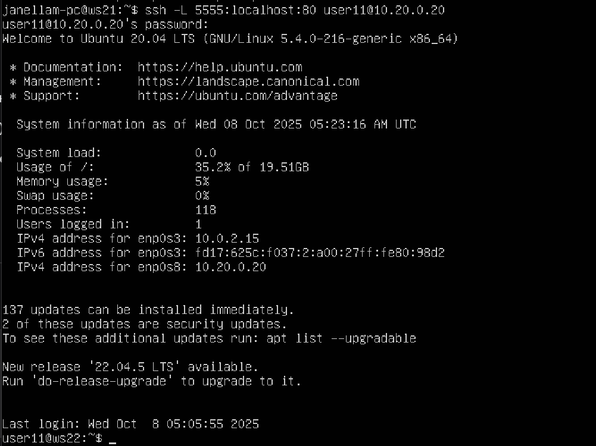
    
    4. #### Делаю *Remote TCP forwarding* c ws11 до ws22, чтобы получить доступ к веб-серверу на ws22 с ws11
    - Пробую подключение с ws11 \
    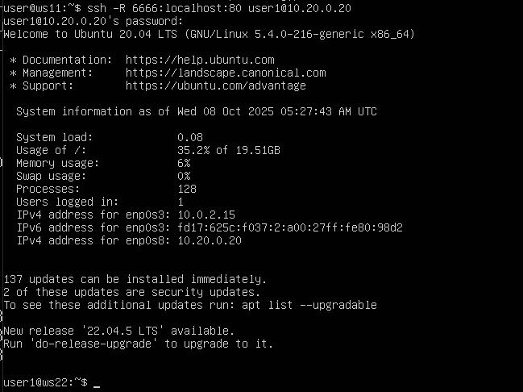
    - Проверяю соединение по `telnet` на ws 21 \
    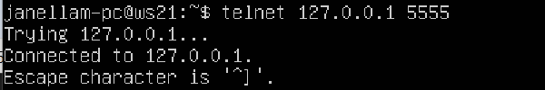
    - Проверяю теперь remote на ws22 \
    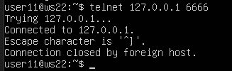