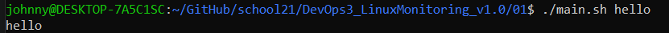
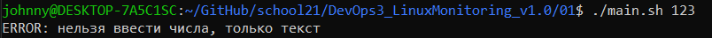
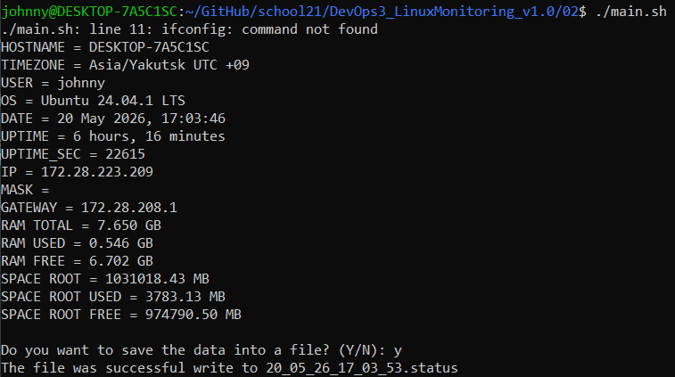
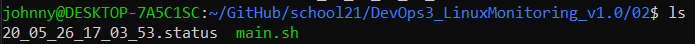
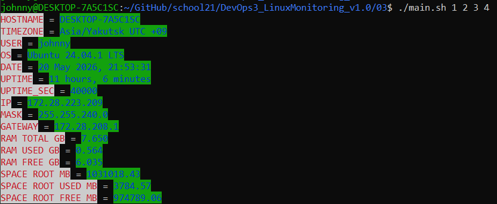
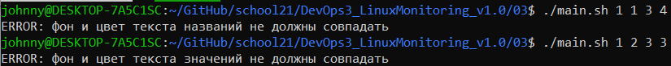
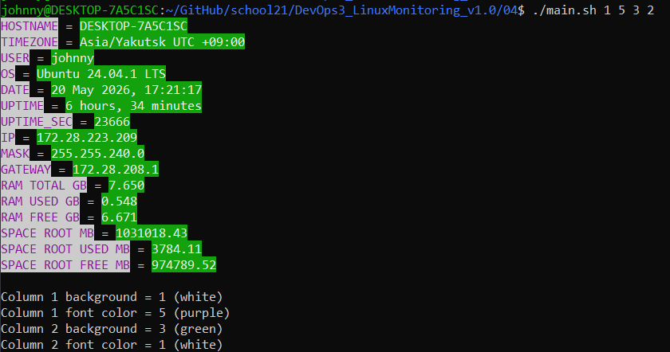
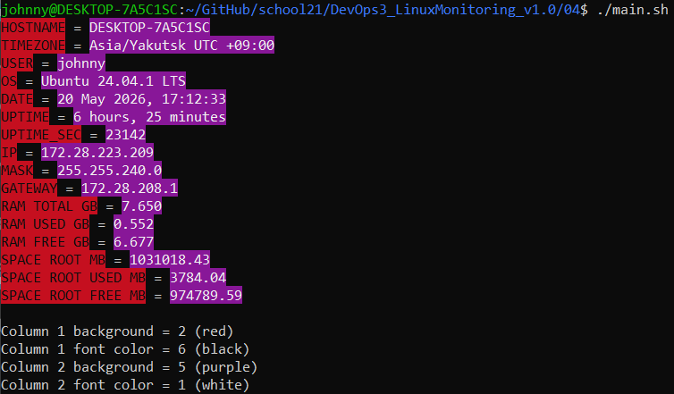
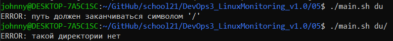
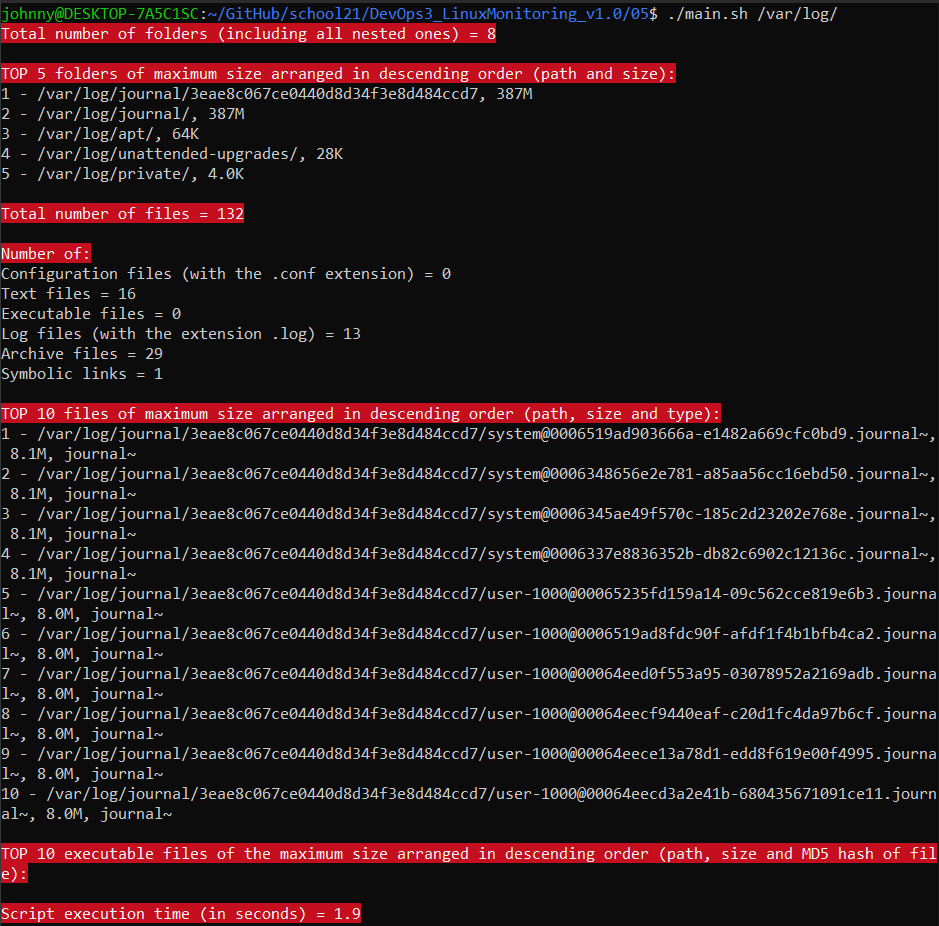

# Отчет по выполнению задания "Linux Monitoring v1.0"
- Я изучил основы Bash, bash-скриптов, автоматизации и углубил знания о Linux.

## List
1. [Проба пера](#part-1-проба-пера)
2. [Исследование системы](#part-2-исследование-системы)
3. [Визуальное оформление вывода для скрипта исследования системы](#part-3-визуальное-оформление-вывода-для-скрипта-исследования-системы)
4. [Конфигурирование визуального оформления вывода для скрипта исследования системы](#part-4-конфигурирование-визуального-оформления-вывода-для-скрипта-исследования-системы)
5. [Исследование файловой системы](#part-5-исследование-файловой-системы)

## Part 1. Проба пера
- ### Создаю bash-скрипт с одним параметром.
  1. Создал файл `main.sh`.
  2. Скрипт принимает один параметр и выводит его значение.
  3. Добавил проверку: если параметр является числом — выводится сообщение об ошибке.
  4. Сделал файл исполняемым через команду `chmod +x main.sh`.
  5. Запускаю скрипт с текстовым параметром:
   
  6. Проверка некорректного ввода:
  

## Part 2. Исследование системы
- ### Создаю bash-скрипт для исследования системы.
  1. Скрипт выводит информацию о системе. Для получения информации использовал команды:
     - `hostname`
     - `timedatectl`
     - `whoami`
     - `lsb_release`
     - `uptime`
     - `ip r`
     - `ifconfig`
     - `free`
     - `df`
  2. Запуск скрипта:
  
  3. Проверка сохранения данных в файл: \
  

## Part 3. Визуальное оформление вывода для скрипта исследования системы
- ### Добавляю цветовое оформление вывода.
  1. Скрипт принимает 4 параметра:
  ```bash
  ./main.sh 1 2 3 4
  ```
  2. Использовал ANSI-коды для цветного вывода в терминале.
  3. Реализовал проверку:
     - цвета текста и фона одного столбца не должны совпадать.
  4. При совпадении цветов выводится сообщение об ошибке.
  5. Пример корректного запуска: \
  
  6. Пример ошибки при совпадении цветов: \
  

## Part 4. Конфигурирование визуального оформления вывода для скрипта исследования системы
- ### Добавляю конфигурационный файл.
  1. Создал конфигурационный файл `config.conf`.
  2. Скрипт запускается без параметров. Если параметры отсутствуют — используются цвета по умолчанию. После вывода информации отображается текущая цветовая схема.
  3. Пример работы скрипта: \
  
  4. Пример работы со значениями по умолчанию: \
  

## Part 5. Исследование файловой системы
- ### Создаю bash-скрипт для исследования файловой системы.
  1. Скрипт запускается с одним параметром:
  ```bash
  ./main.sh /var/log/
  ```
  2. Реализовал проверку: \
   
  3. Скрипт выводит:
     - общее количество папок;
     - топ-5 папок по размеру;
     - общее количество файлов;
     - количество `.conf`, `.txt`, `.log`, архивов, символических ссылок;
     - топ-10 файлов по размеру;
     - топ-10 исполняемых файлов;
     - время выполнения скрипта.
  4. Для анализа файловой системы использовал утилиты `find`, `du`, `awk`, `sort`, `head` и `md5sum`.
  5. Пример запуска:\
  
  6. Пример вывода исполняемых файлов:\
  

