# Отчет по выполнению задания "LinuxMonitoring v2.0"
- Я изучил мониторинг в Linux, анализ логов, работу с Prometheus, Grafana и GoAccess.

## List
1. [Генератор файлов](#part-1-генератор-файлов)
2. [Засорение файловой системы](#part-2-засорение-файловой-системы)
3. [Очистка файловой системы](#part-3-очистка-файловой-системы)
4. [Генератор логов](#part-4-генератор-логов)
5. [Мониторинг](#part-5-мониторинг)
6. [GoAccess](#part-6-goaccess)
7. [Prometheus и Grafana](#part-7-prometheus-и-grafana)
8. [Готовый дашборд](#part-8-готовый-дашборд)
9. [Дополнительно. Свой node_exporter](#part-9-дополнительно-свой-node_exporter)

## Part 1. Генератор файлов
- ### Создаю скрипт на bash для генерации файлов и папок
  1. Скрипт принимает 6 параметров:
  ```bash
  ./main.sh /opt/test 4 az 5 az.az 3kb
  ```
  2. Реализовал проверку:
     - абсолютного пути;
     - количества параметров;
     - размера файла;
     - корректности имени файлов и папок.
  3. Скрипт создает папки и файлы с использованием указанных букв
  4. Добавил проверку свободного места:
     - скрипт завершает работу при остатке менее 1 Гб
  5. В лог-файл записываются:
     - полный путь;
     - дата создания;
     - размер файла.
  6. Пример запуска скрипта:\
  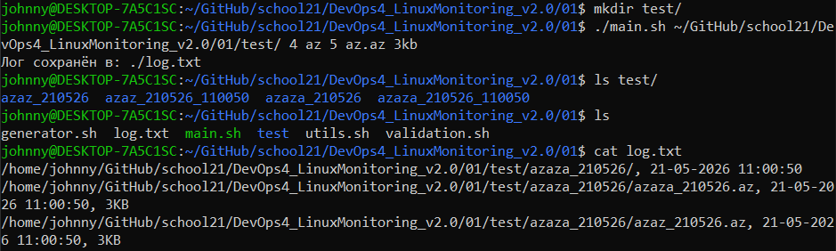

## Part 2. Засорение файловой системы
- ### Создаю скрипт bash который засоряет комп.
  1. Скрипт случайным образом создает папки и файлы
      > Сначала скрипт создавал слишком много файлов и быстро забивал диск, поэтому добавил проверку свободного места через `df`
  2. Использовал команды: `mkdir`, `touch`, `dd`, `find`, `df`
  3. При генерации случайных директорий пришлось исключить системные папки `/bin` и `/sbin`. Скрипт завершает работу при остатке менее 1 Гб свободного места
  4. В лог-файл добавляется:
     - время начала работы;
     - время окончания;
     - общее время выполнения.
  5. Пример работы скрипта до засорения:\
  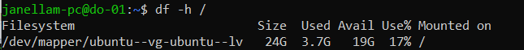
  6. Пример после засорения:\
  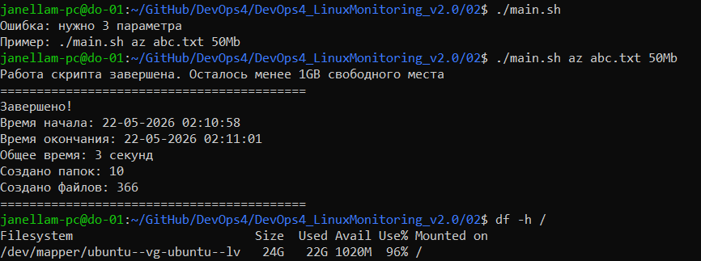

## Part 3. Очистка файловой системы
- ### Создаю bash-скрипт для очистки файловой системы
  1. Реализовал 3 способа удаления:
     - по лог-файлу;
     - по времени создания;
     - по маске имени.
  2. Пример удаления по лог-файлу:\
  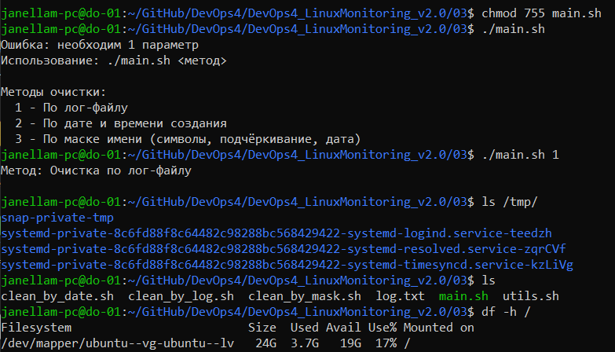
  3. Пример удаления по времени:\
  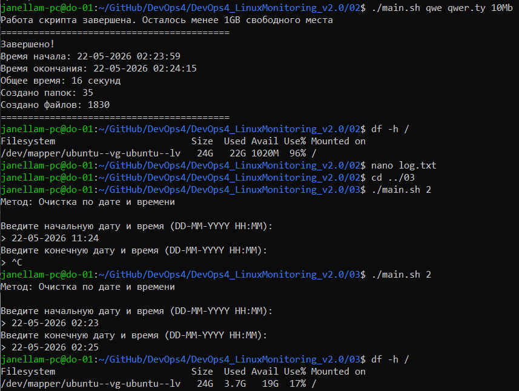
  4. Пример удаления по маске:\
  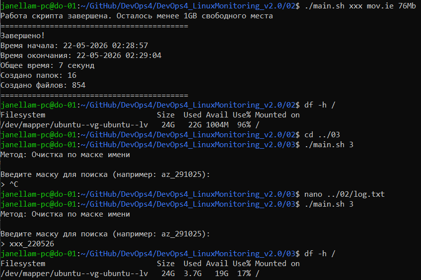

## Part 4. Генератор логов
- ### Создаю bash-скрипт для генерации nginx-логов
  1. Скрипт генерирует 5 файлов логов
  2. Каждый лог содержит:
     - IP-адрес;
     - HTTP-метод;
     - код ответа;
     - URL;
     - User-Agent;
     - дату запроса.
  3. Использовал формат nginx combined
  4. Реализовал случайную генерацию:
     - IP;
     - кодов ответа;
     - методов;
     - User-Agent.
  5. Пример сгенерированного лога:
  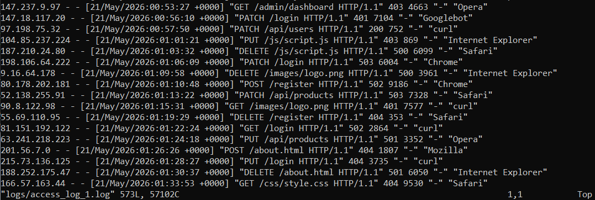

## Part 5. Мониторинг
- ### Анализирую nginx-логи из задания Part 4. через awk
  1. Скрипт принимает параметр от 1 до 4:
     1. всех записей по коду ответа;
     2. уникальных IP;
     3. ошибочных запросов;
     4. IP ошибочных запросов.
  3. Для обработки логов использовал: `awk`, `sort`
  4. Пример запуска:
  ```bash
  ./main.sh 1
  ```
  5. Пример работы скрипта:\
  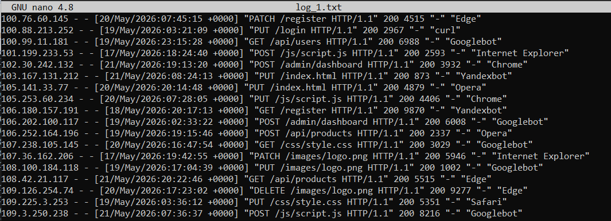

## Part 6. GoAccess
- ### Анализирую логи через GoAccess
  1. Установил утилиту:
  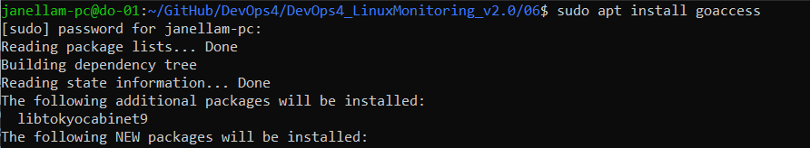
  2. Запустил анализ логов:
  ```bash
  goaccess ../04/logs/*.log --log-format=COMBINED
  ```
  3. Пример работы GoAccess:
  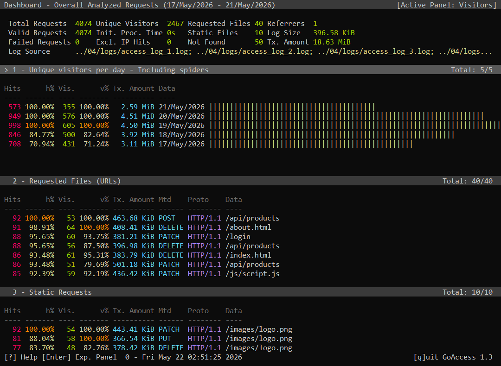

## Part 7. Prometheus и Grafana
- ### Настраиваю мониторинг системы
  1. Установил:
     - Prometheus;
     - Grafana;
     - node_exporter.
  2. Получил доступ к веб-интерфейсам с локальной машины:\
  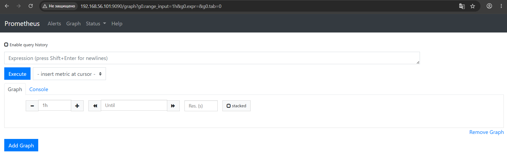\
  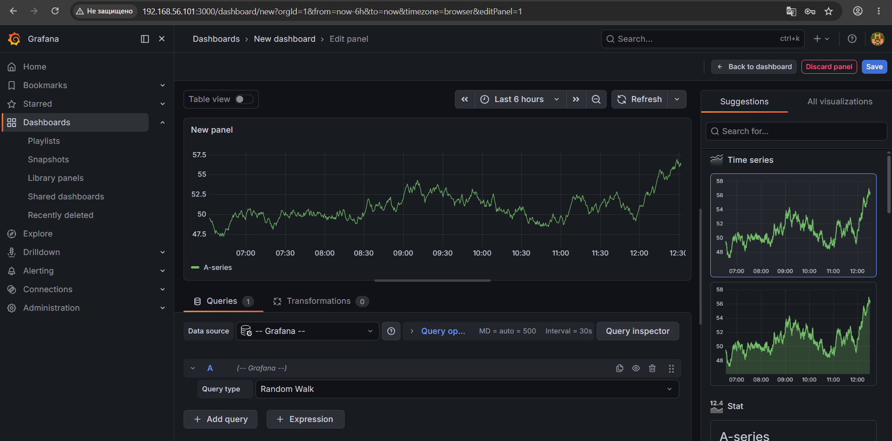\
  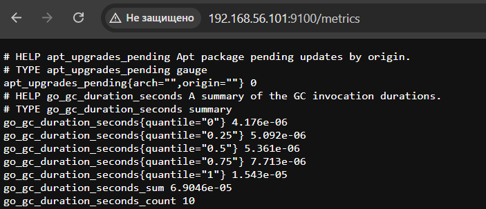
  3. Добавил в дашборд Grafana отображение ЦПУ, доступной оперативной памяти, свободное место и кол-во операций ввода/вывода на жестком диске
  4. Проверил нагрузку жесткого диска (место на диске и операции чтения/записи) через скрипт засорения из "Part 2." и через:
  ```bash
  stress -c 2 -i 1 -m 1 --vm-bytes 32M -t 10s
  ```
  5. Наблюдал изменение метрик в Grafana: \
  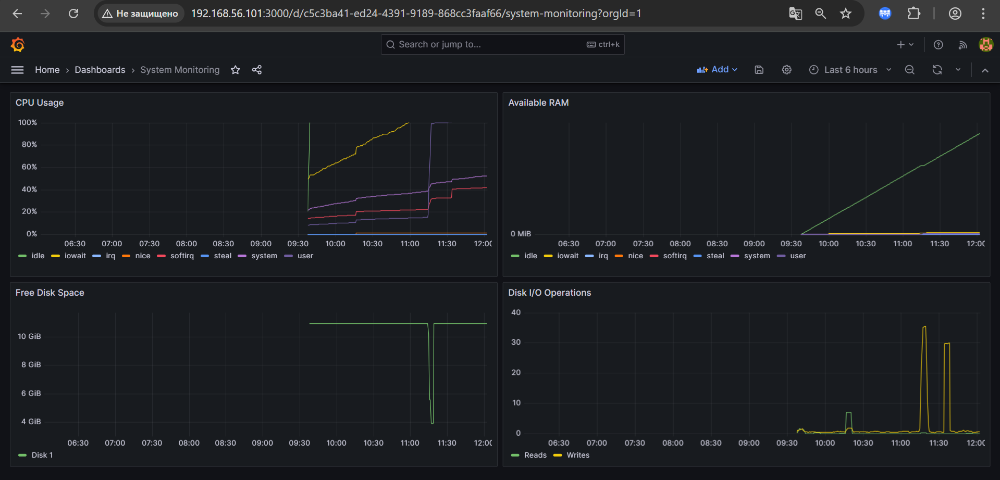

## Part 8. Готовый дашборд
- ### Подключаю готовый дашборд *Node Exporter Full* с официального сайта **Grafana Labs**
  1. Импортировал дашборд 12486, проверил отображение:\
  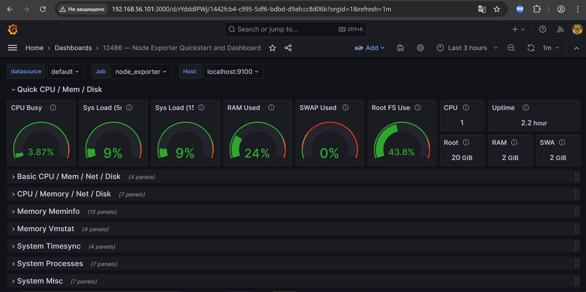
  2. Запустил вторую виртуальную машину. Провел тест сети через `iperf3 -s` на сервере и на второй команду `iperf3 -c 192.168.56.101` для сетевой нагрузки:\
  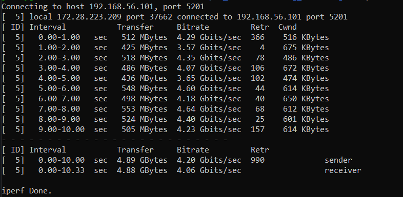
  3. Наблюдал сетевую нагрузку в Grafana:\
  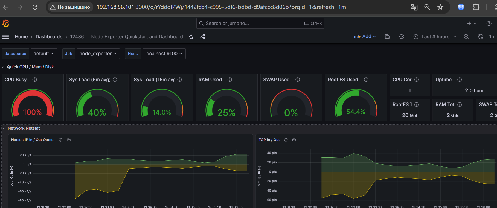