# Отчет по выполениню задания Simple Docker
- Я изучил докер, разработку простого докер-образа для собственного сервера.

## List
1. [Готовый докер](#part-1-готовый-докер) \
2. [Операции с контейнером](#part-2-операции-с-контейнером) \

## Part 1. Готовый докер
  - ### Установка `docker` на **Ubuntu**
  - Использую инструкцию с официального сайта \
  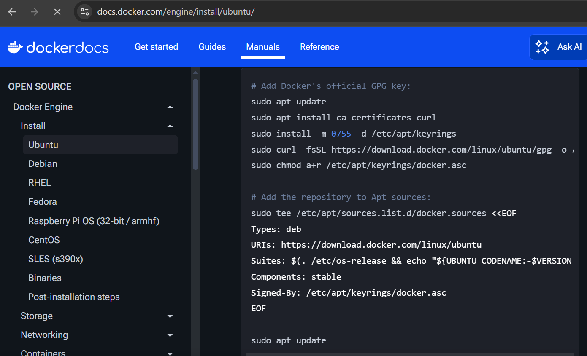
  - Проверяю установку \
  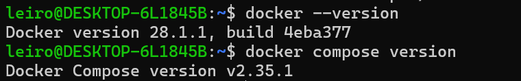
  - Проверяю работу демона \
  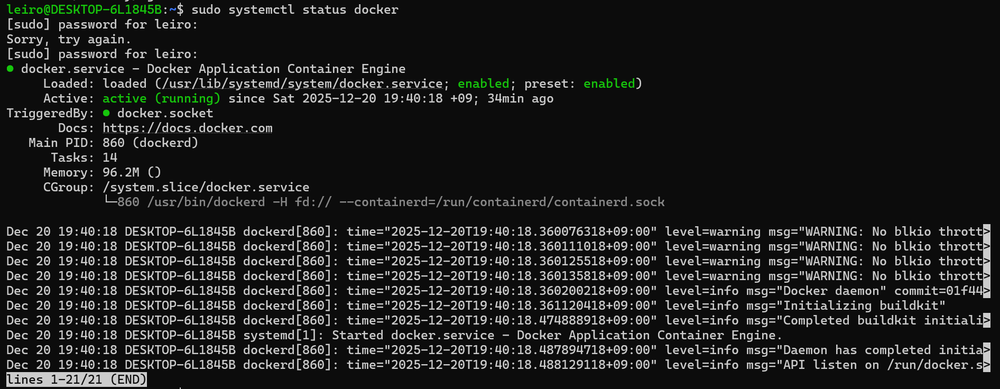
  - Качаю образ `nginx` \
  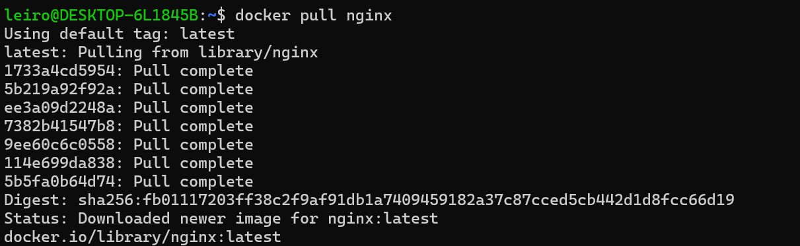
  - Смотрю список образов \
  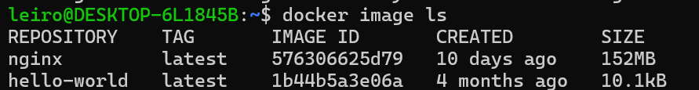
  - Запускаю докер-образ и проверяю через `docker ps` \
  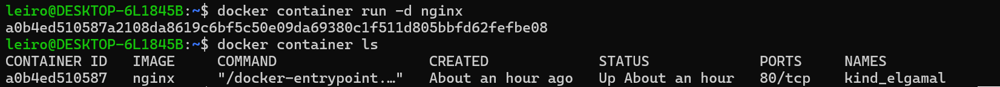
  - Смотрю информацию о контейнере \
  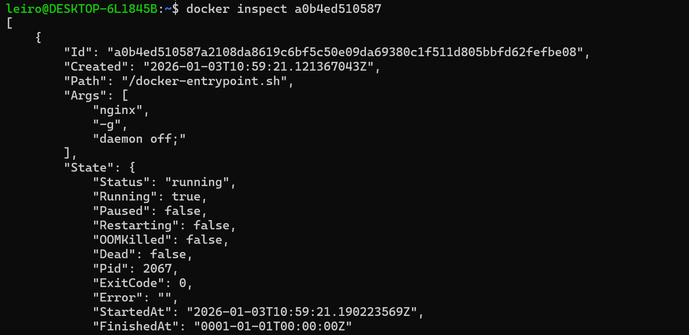
  - IP-адрес 172.17.0.2, порт контейнера 80, проброса порта на хост нету т.к. была команда без флага `-p [host_ip]:host_port:container_port[/protocol]` \
  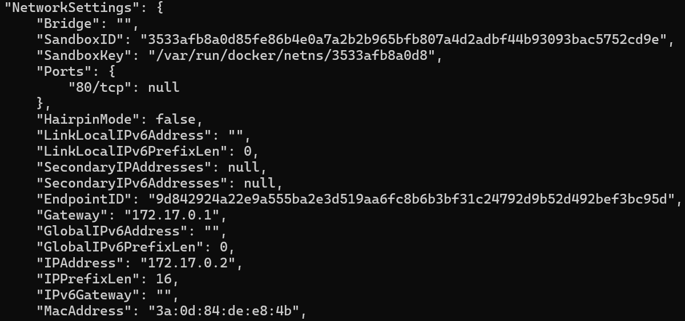
  - Предыдущая команда не показывает размер контейнера поэтому используем другую команду для этого: \
  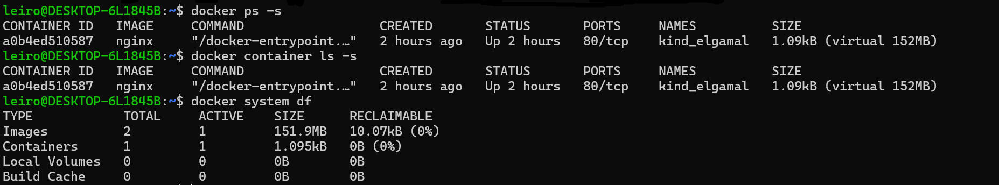
    + размер контейнера 1.095kB (virtual 152MB)
    + `docker ps -s` (новый синтаксис `docker container ls -s`)
    + `docker system df` (т.к. у меня запущен 1 контейнер, то можно и тут глянуть)
  - Остановка докер контейнера и проверка его статуса \
  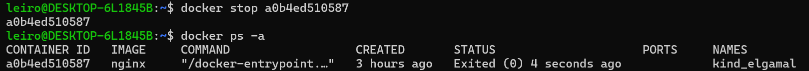
  - Запускаю докер с портами 80 и 443 в контейнере, замапленными на такие же порты на локальной машине, через команду *run* \
  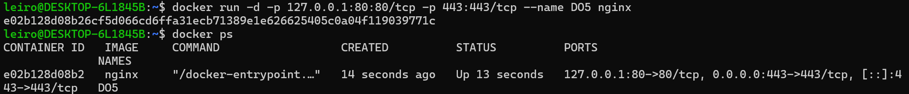
  - Проверяю браузер по адресу `localhost:80` \
  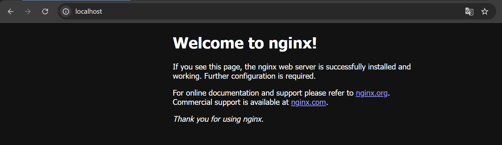
  - Перезапускаю докер контейнер \
  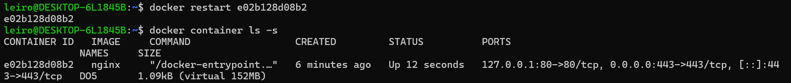

## Part 2. Операции с контейнером
  - Запускаю команду `docker exec` \
  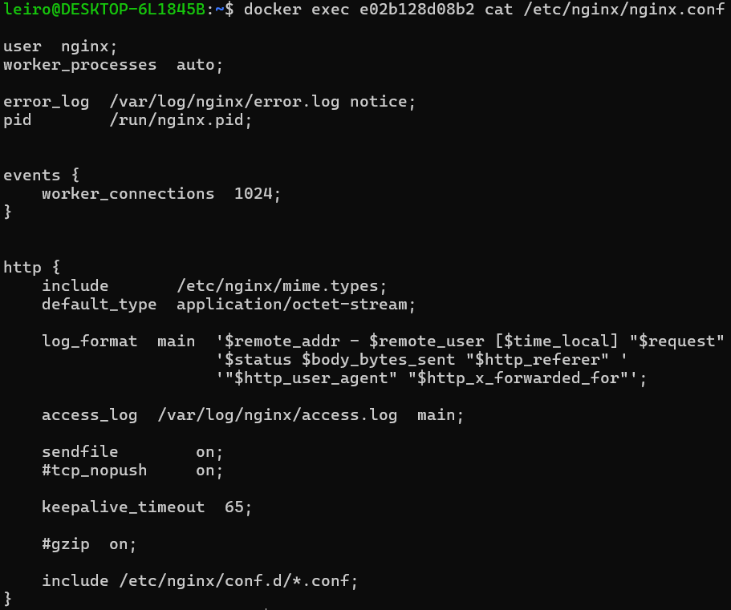
  - Создаю файл `nginx.conf` на хостовой машине \
  
  - Добавляю отдачу страницы статуса сервера \
  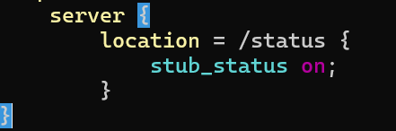
  - Копирую конфиг в контейнер \
  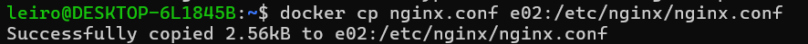
  - Перезагружаю `nginx` в контейнере \
  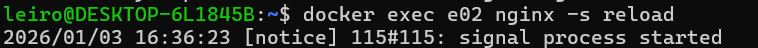
  - Проверяю сайт \
  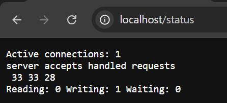
  - Экспорт контейнера \
  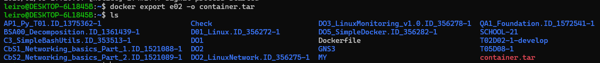
  - Останавливаю контейнер \
  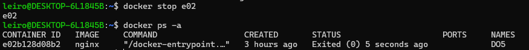
  - Удаляю образ`nginx` \
  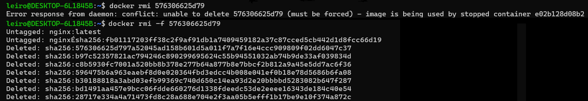
  - Удаляю контейнер \
  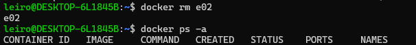
  - Импортирую контейнер обратно \
  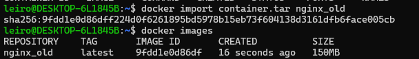
  - Запускаю контейнер со второй попытки \
  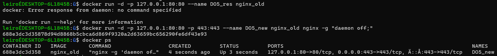
  - Оказывается import стирает мета-данные и их надо вручную вписать для запуска контейнера. Адрес localhost:80/status работает \
  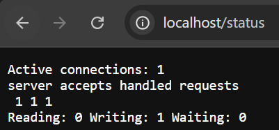
