# Отчет по выполениню задания CICD

## Part 1. Настройка **gitlab-runner**
- ### Поднять виртуальную машину *Ubuntu Server 22.04 LTS*
- Решил использовать ВМ из последнего проекта DO2 \
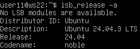
- Качаю **gitlab-runner** \
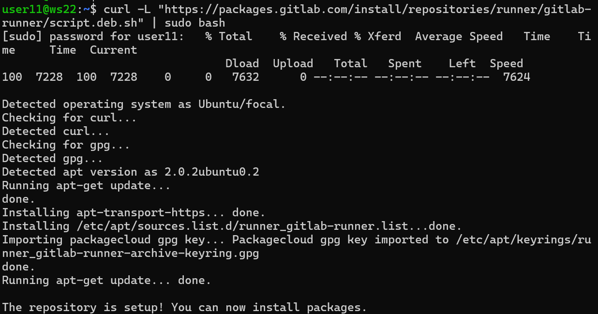
- Устанавливаю на виртуальную машину **gitlab-runner** \
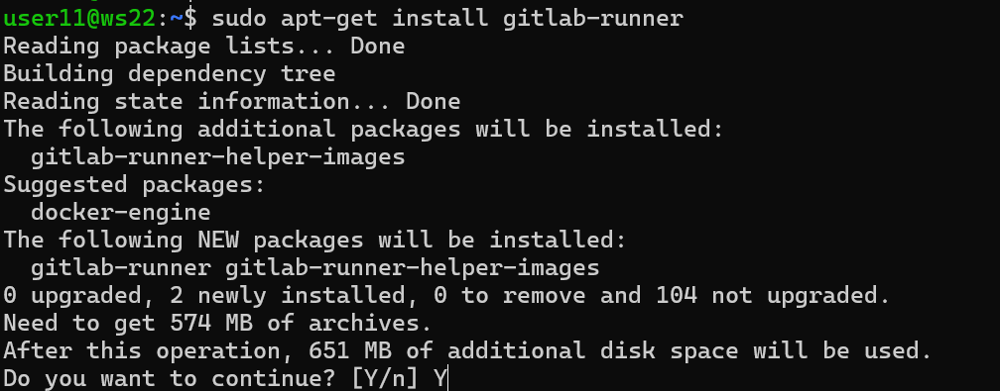
- Запускаю **gitlab-runner** и регистрирую его для использования в текущем проекте (*DO6_CICD*).
- Для регистрации понадобились URL и токен, которые можно получить на страничке задания на платформе. \
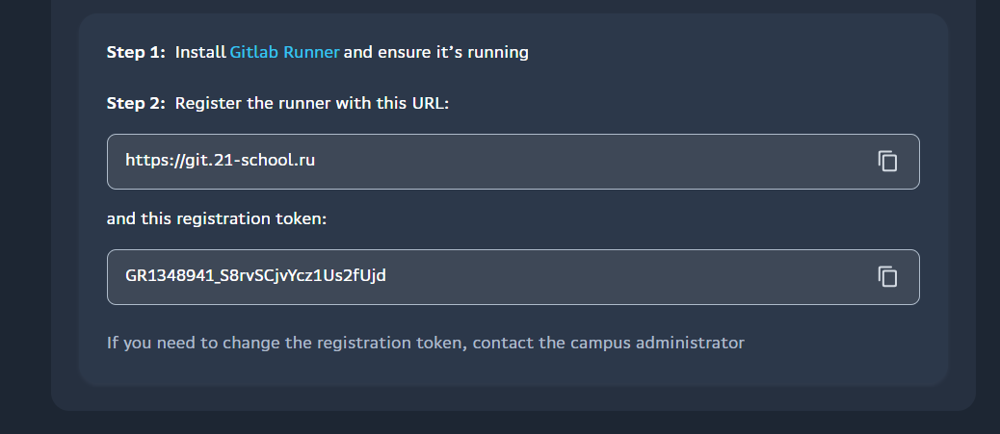   
- Добавляю тэги для раннера:
build, style, test, deploy, bot \
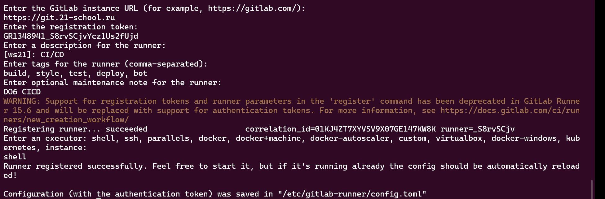
- Проверка, что гитлаб-раннер работает. \
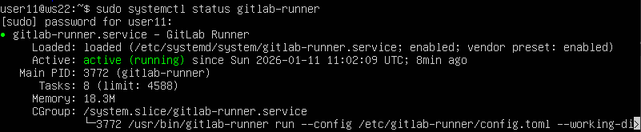    

## Part 2. Сборка
- ### Написать этап для **CI** по сборке приложения `main` из папки `code-samples/`
- Клонирую все папку в `src/`
- Создаю файл `.gitlab-ci.yml` в корневой папке репы
- В файле `.gitlab-ci.yml` добавляю этап запуска сборки через мейк файл из проекта \
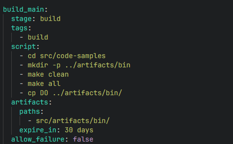
- Так выглядит выполненный пайплайн \  
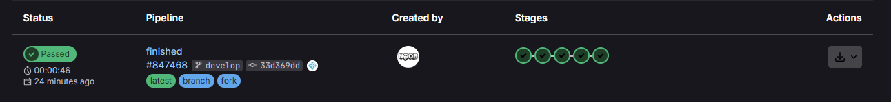  

## Part 3. Тест кодстайла
- ### Написать этап для **CI**, который запускает скрипт кодстайла
- В файле `.gitlab-ci.yml` добавляю этап запуска проверки стиля кода \
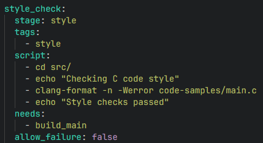

## Part 4. Интеграционные тесты
- ### Напиcaть этап для **CI**, который запускает тесты приложения 
- В файле `.gitlab-ci.yml` добавляю этап тестирования \
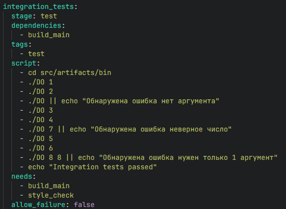  
- В пайплайне вывод, что тесты успешно прошли \
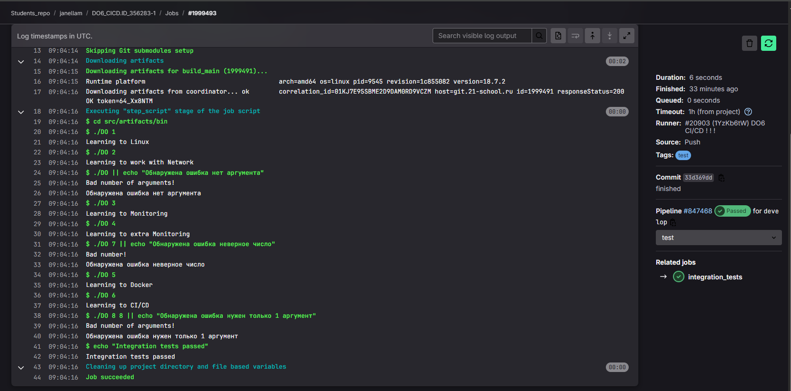
- Этот этап автоматически запускается только при условии, если сборка и тест кодстайла прошли успешно

## Part 5. Этап деплоя
- ### Создать или клонировать вторую виртуальную машину *Ubuntu Server 22.04 LTS*
- Запускаю ВМ из проекта DO2
- Проверяю **Ping** между машинами и **IP** адреса \
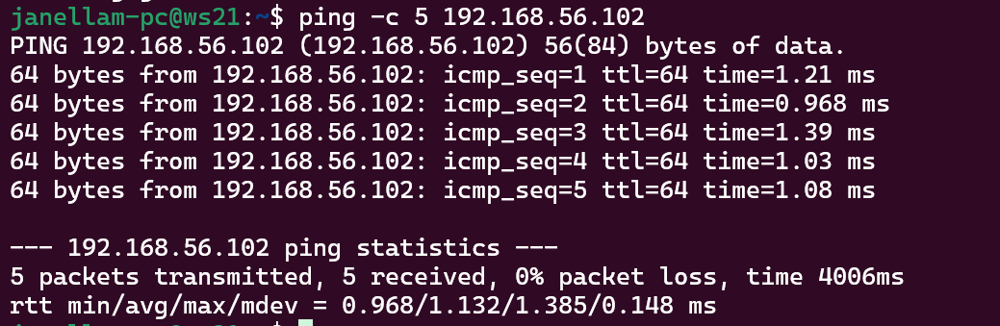 
- Создаю ключ на `ws22` и проверяю наличие ключей в папке с помощью команды `sudo ls -la /home/gitlab-runner/.ssh` \
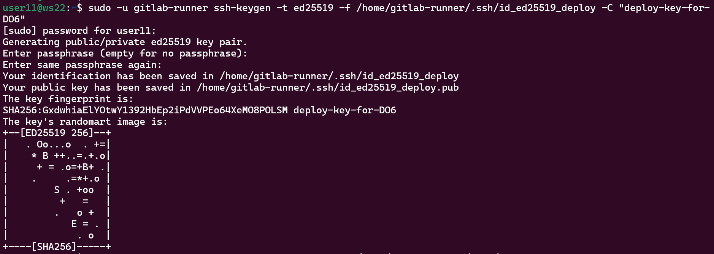  
- Копирую и проверяю публичный файл с ключом \
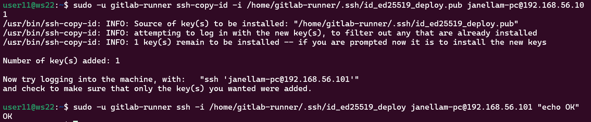  
- Добавляем этап для **CD**, который «разворачивает» проект на виртуальной машине `ws21`
- Создаем скрипт для стадии `deploy`, чтобы при помощи **ssh** и **scp** копировать файлы, полученные после сборки (артефакты), в директорию */usr/local/bin* второй виртуальной машины \
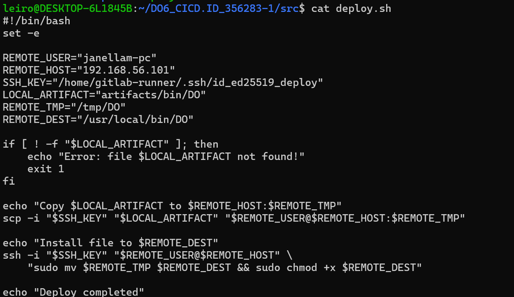
- Файлы лежат на второй машине `ws21` \

## Part 6. Дополнительно. Уведомления
- ### Настрой уведомления об успешном/неуспешном выполнении пайплайна через бота с именем «[твой nickname] DO6 CI/CD» в Telegram
- Открываю Telegram и нахожу бота **_@BotFather_** и жму создать нового бота  
- Даю имя бота **_"janellam DO6 CI/CD"_**
- Сохраняю токен доступа, который выдаст **_@BotFather_**.  
- Узнаем **_Chat ID_** с помощью бота **_@Getmyid_bot_**
- Пишем скрипт работы бота и добавляем его в папку `src/`, далее как последний этап в yml-файл с помощью специальной стадии `.post`
- Бот работает \
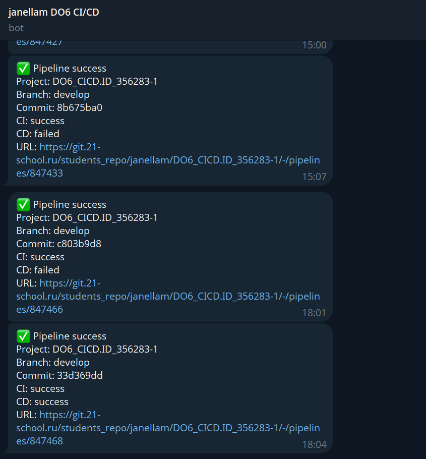